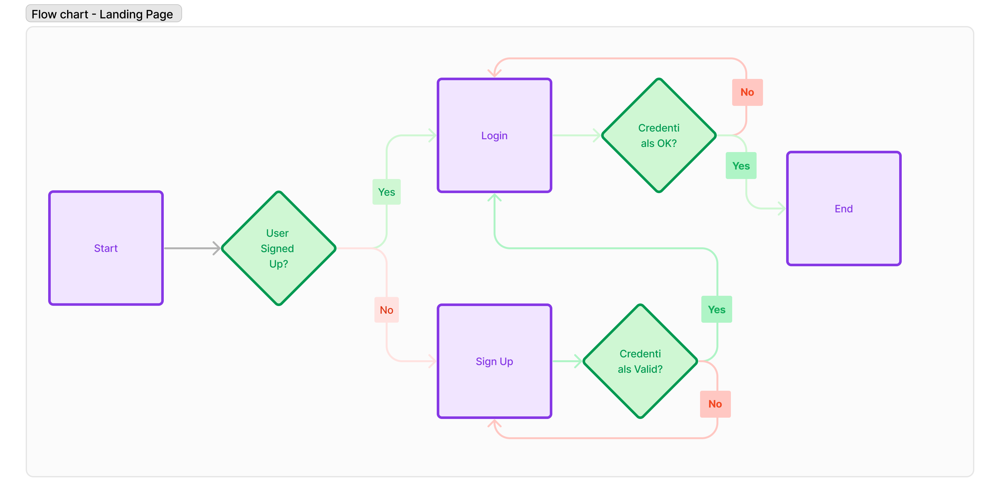
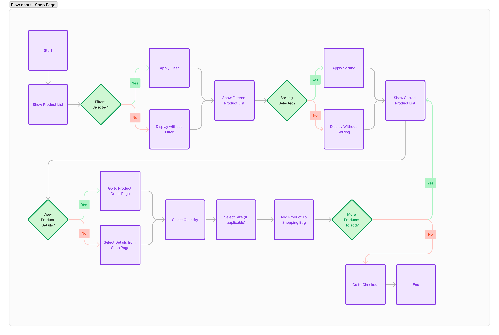
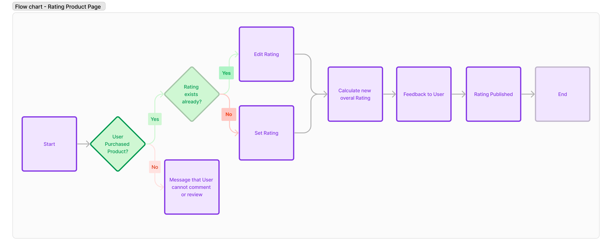
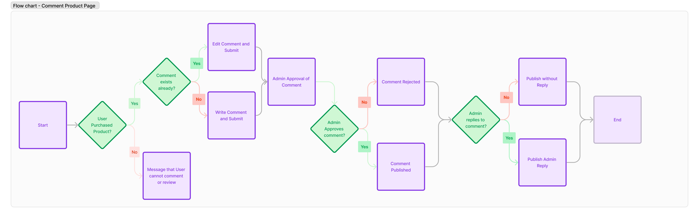
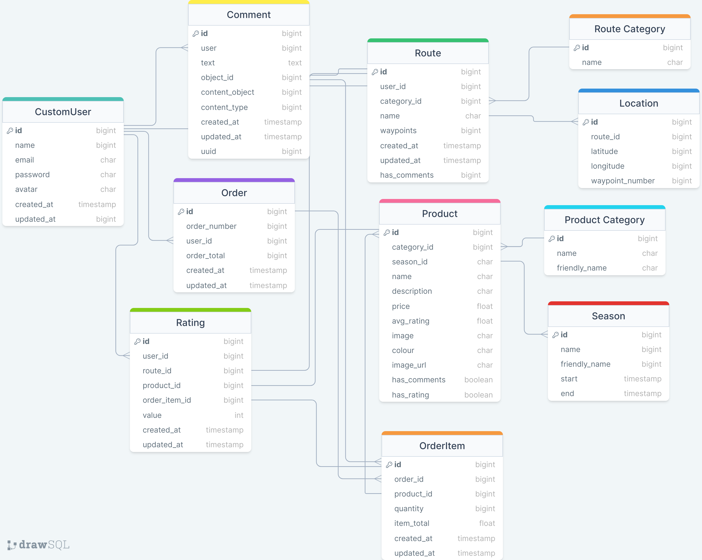
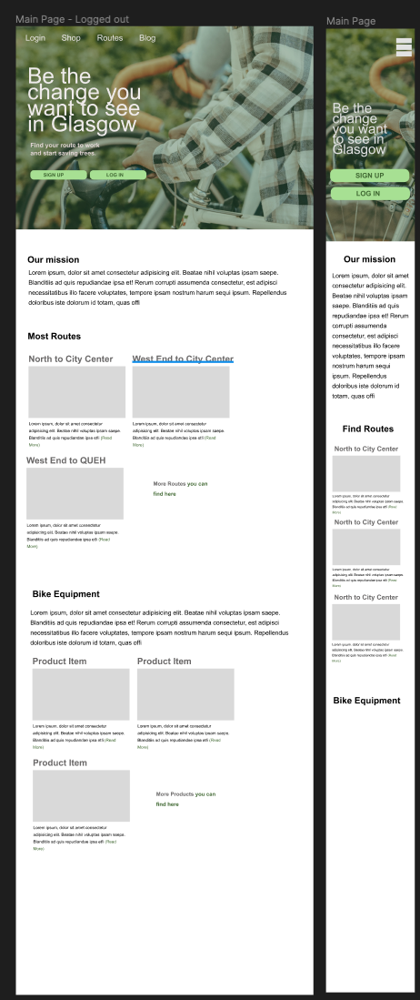
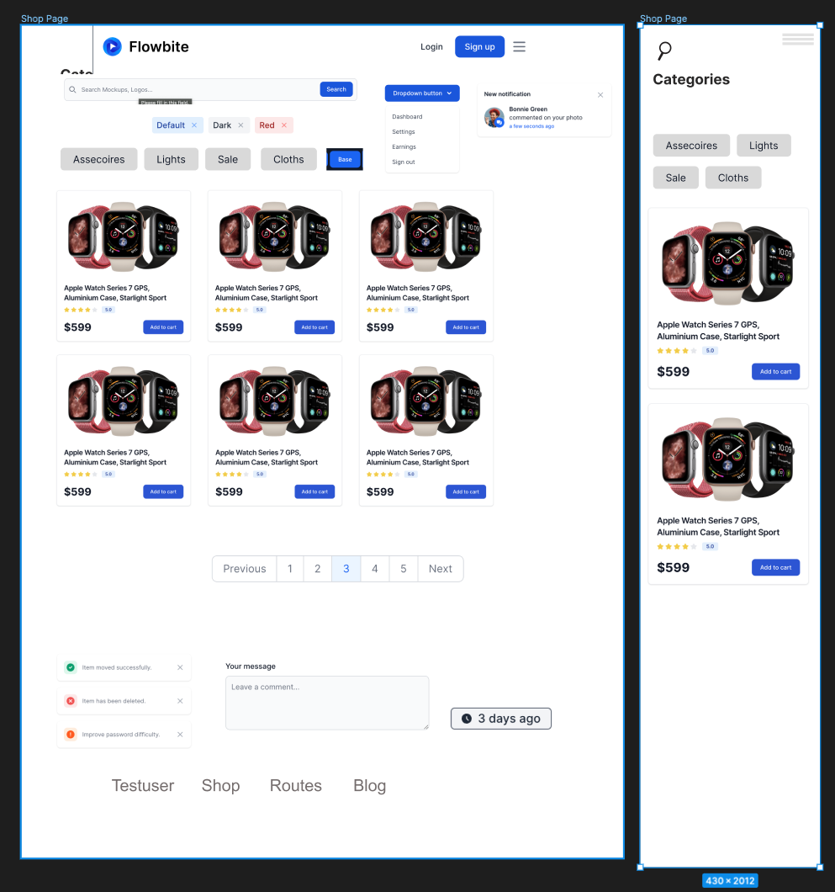
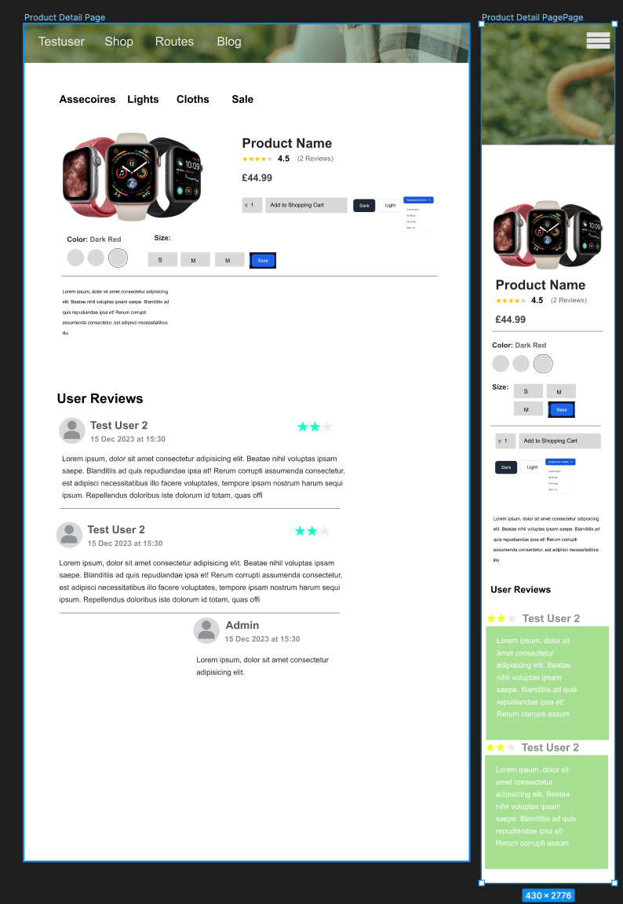
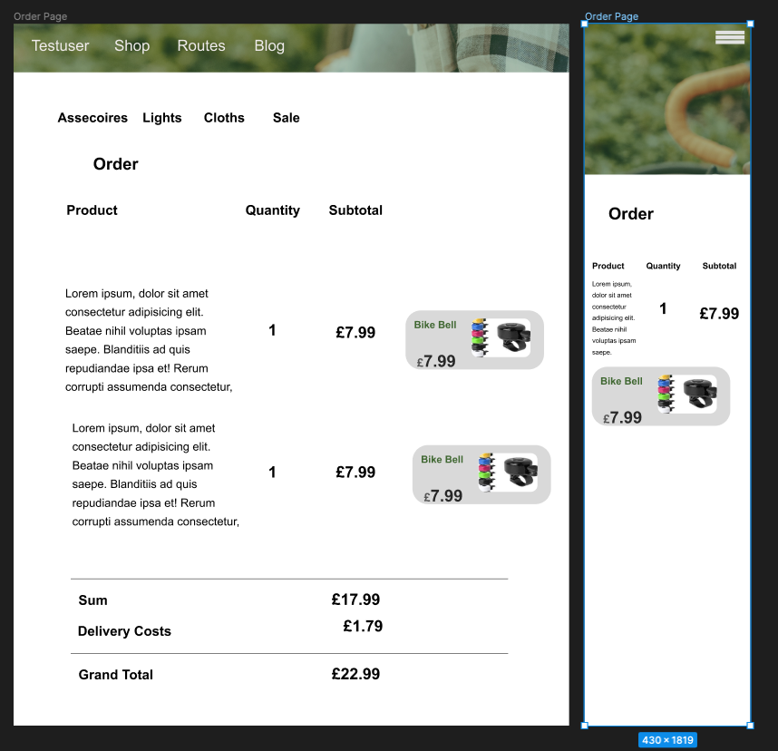

   

# City Cycling Glasgow

This project is a website for a fictional eCommerce online shop called 'City Cycling' that sells bike equipment. The shop targets both experienced cyclists and those who are beginning to cycle or planning to commute to work via cycling, with an  more general goal of promoting health, sustainability and a more bike-friendly Glasgow. 

### Project Goal

- Encourage users to cycle to work and provide high-quality equipment 
- Generate sales of bike equipment 
- Provide option of user comments and product rating to allow user feedback 

Link to deployed version on [Heroku - City Cycling](https://city-cycling-e08bb339a180.herokuapp.com/)

Link to GitHub Project Board [GitHub Projects - City Cycling](https://github.com/users/nils-n/projects/17/views/1)

Link to User Stories incl. MoSCow prioritization [Numbers Document](./assets/sheets/user-stories-moscow-bikes.numbers)

  

    <table style='width:90%; content-align:center'>
        <tr>
          <td>   </td>
        </tr>
    </table>
  

    

---

### Table of Content

- [City Cycling Glasgow](#city-cycling-glasgow)
    - [Project Goal](#project-goal)
    - [Table of Content](#table-of-content)
  - [User Experience (UX)](#user-experience-ux)
    - [Website Aims](#website-aims)
    - [How these needs are addressed](#how-these-needs-are-addressed)
    - [Opportunities](#opportunities)
    - [Feature selection](#feature-selection)
    - [User Stories](#user-stories)
    - [Agile Methodology](#agile-methodology)
    - [Design](#design)
      - [Color Scheme](#color-scheme)
      - [Typography](#typography)
  - [Marketing Strategies](#marketing-strategies)
    - [Business Model](#business-model)
    - [SEO](#seo)
  - [Features](#features)
    - [General Features](#general-features)
    - [Navbar](#navbar)
    - [Landing Page](#landing-page)
    - [Login/Signup Page](#loginsignup-page)
    - [Profile Page](#profile-page)
    - [Shop Page](#shop-page)
    - [Product Detail Page](#product-detail-page)
    - [Checkout Pages](#checkout-pages)
    - [Other Pages](#other-pages)
  - [Logic and Flow Diagrams](#logic-and-flow-diagrams)
    - [Landing Page](#landing-page-1)
    - [Shop Page](#shop-page-1)
    - [Profile Page](#profile-page-1)
  - [Flow Charts](#flow-charts)
  - [Models](#models)
  - [Wireframes](#wireframes)
    - [Future Implementations](#future-implementations)
    - [Accessibility](#accessibility)
  - [Technologies Used](#technologies-used)
    - [Languages](#languages)
    - [Frameworks](#frameworks)
  - [Deployment](#deployment)
    - [Setup for Heroku](#setup-for-heroku)
    - [Setup for AWS (Static Files)](#setup-for-aws-static-files)
    - [How to Fork](#how-to-fork)
    - [How to Clone](#how-to-clone)
  - [Testing](#testing)
      - [Limitation](#limitation)
    - [Solved Bugs](#solved-bugs)
    - [Open Bugs](#open-bugs)
  - [Credits](#credits)
    - [Code Used](#code-used)
    - [Content](#content)
- [Acknowledgements](#acknowledgements)

---

## User Experience (UX)

### Website Aims

### How these needs are addressed

### Opportunities

### Feature selection

### User Stories

### Agile Methodology

---

### Design

#### Color Scheme

#### Typography

---

## Marketing Strategies

### Business Model

### SEO

---

## Features

### General Features

### Navbar

### Landing Page

### Login/Signup Page

### Profile Page

### Shop Page

### Product Detail Page

### Checkout Pages

### Other Pages

These pages contain a friendly message when the 404 and 403 server error has occured.

- 404 page: appears when the user enters a URL that does not exist
- 403 page: appears when users try to enter a site that they have no authorization for

---

---

## Logic and Flow Diagrams

### Landing Page

### Shop Page

### Profile Page

## Flow Charts

---

## Models

---

## Wireframes

---

### Future Implementations

---

### Accessibility

---

## Technologies Used

- [DrawSQL](https://drawsql.app/) to draw ERD diagram for the DB tables
- Git / [Github](https://github.com/) for Version Control
- [VS Code ](https://code.visualstudio.com/) as local IDE
- [Figma](https://www.figma.com/) for Wireframs and Flowcharts
- [Shields.io](https://shields.io/) for Readme badges
- convert markdown tables to html via [HTML Table Converter](https://tableconvert.com/markdown-to-html)
- [Prettier](https://marketplace.visualstudio.com/items?itemName=esbenp.prettier-vscode) VS Code formatter
- [icecream](https://github.com/gruns/icecream) for more expressive print statements
- [ruff](https://docs.astral.sh/ruff/) for code formatting
- [Flowbite](https://flowbite.com/) components for Tailwind CSS

### Languages

- HTML
- CSS
- Python
- Javascript

### Frameworks

- [Django](https://www.djangoproject.com/) for backend server
- [Tailwind CSS](https://tailwindcss.com/) for frontend / UI / CSS
- [Pytest](https://docs.pytest.org/en/7.4.x/) for Unit Testing
- [Stripe](https://stripe.com/en-de) for Payments

---

## Deployment

### Setup for Heroku

### Setup for AWS (Static Files)

### How to Fork

- Log into GitHub and navigate to this repository
- Click on the "Main" Branch button and type the name of the forked branch
- Click on "Create Branch" to confirm

### How to Clone

- Click on the "Code" button and copy the link to this repository
- open terminal on your machine and navigate to the folder you want to store a local copy
- in the terminal, type 'git clone ' followed by the link you copied
- press enter to confirm

---

## Testing

#### Limitation

---

### Solved Bugs

---

### Open Bugs

---

## Credits

### Code Used

- User and Login/Logout functionality using a Custom User Model : [LearnDjango - Django Best Practices: Custom User Model](https://learndjango.com/tutorials/django-custom-user-model)
- Cookie setup for handling CSRF Tokens when using AJAX [Github](https://github.com/realpython/django-form-fun/blob/master/part1/main.js) as referenced in this blog post [Django and AJAX Form Submissions – Say 'Goodbye' to the Page Refresh](https://realpython.com/django-and-ajax-form-submissions/)

### Content

- All of the content was written by myself.
- Externally used code (such as code snippets from stackoverflow) in this project are referenced in this Readme and inside the HTML / CSS / JS / Python source code.

# Acknowledgements

- Teaching and Support from Code Insitute [Code Insitute](https://codeinstitute.net/)
- Convert Excel Tables (User Stories) into Markdown format [Link to TableConvert](https://tableconvert.com/)
- Images from [Pexels](https://pexels.com/) using [this image](https://www.pexels.com/photo/diverse-girlfriends-riding-bicycles-on-street-5965721/) for background image on landing page
  - Photographer : [Charlotte May](https://www.pexels.com/@charlotte-may/)
- Example Readme from Kera Cudmore [Kera's Github](https://github.com/kera-cudmore/readme-examples/blob/main/milestone1-readme.md)
- How to use factoryboy with pytest for testing functions (Very Academy) [Pytest | Django | Introducing Factory Boy and Faker - Fixture Replacement](https://youtu.be/qrvqNdCDKjM?feature=shared)
- Setup of automatic tests using Github Actions and pytest
  - Okken, Brian. "Python Testing with pytest." (2nd ed.) Pragmatic Bookshelf, 2022.
  - Automated Testing in Python with pytest, tox, and GitHub Actions [mCoding (Youtube) ](https://www.youtube.com/watch?v=DhUpxWjOhME)
- Thanks to my mentor Ronan (Code Institute) for providing insightful feedback and engaging discussions
