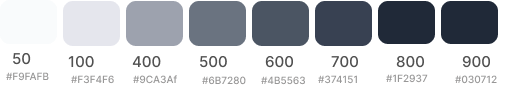

   

# City Cycling Glasgow

This project is a website for a fictional eCommerce online shop called 'City Cycling' that sells bike equipment. The shop targets both experienced cyclists and those who are beginning to cycle or planning to commute to work via cycling, with an more general goal of promoting health, sustainability and a more bike-friendly Glasgow.

### Project Goal

- Encourage users to cycle to work and provide high-quality equipment
- Generate sales of bike equipment
- Provide option of user comments and product rating to allow user feedback

Link to deployed version on [Heroku - City Cycling](https://city-cycling-e08bb339a180.herokuapp.com/)

Link to GitHub Project Board [GitHub Projects - City Cycling](https://github.com/users/nils-n/projects/17/views/1)

Link to User Stories incl. MoSCow prioritization [Numbers Document](./assets/sheets/user-stories-moscow-bikes.numbers)

  

    <table style='width:90%; content-align:center'>
        <tr>
          <td>   </td>
        </tr>
    </table>
  

    

---

### Table of Content

- [City Cycling Glasgow](#city-cycling-glasgow)
  - [Project Goal](#project-goal)
  - [Table of Content](#table-of-content)
  - [User Experience (UX)](#user-experience-ux)
    - [Website Aims](#website-aims)
    - [How these needs are addressed](#how-these-needs-are-addressed)
    - [Opportunities](#opportunities)
    - [Feature selection](#feature-selection)
    - [User Stories](#user-stories)
    - [Agile Methodology](#agile-methodology)
    - [Design](#design)
      - [Color Scheme](#color-scheme)
      - [Typography](#typography)
  - [Marketing Strategies](#marketing-strategies)
    - [Business Model](#business-model)
    - [SEO](#seo)
  - [Features](#features)
    - [General Features](#general-features)
    - [Navbar](#navbar)
    - [Landing Page](#landing-page)
    - [Login/Signup Page](#loginsignup-page)
    - [Profile Page](#profile-page)
    - [Shop Page](#shop-page)
    - [Product Detail Page](#product-detail-page)
    - [Checkout Pages](#checkout-pages)
    - [Other Pages](#other-pages)
  - [Logic and Flow Diagrams](#logic-and-flow-diagrams)
    - [Landing Page](#landing-page-1)
    - [Shop Page](#shop-page-1)
    - [Profile Page](#profile-page-1)
  - [Flow Charts](#flow-charts)
  - [Models](#models)
  - [Wireframes](#wireframes)
    - [Future Implementations](#future-implementations)
    - [Accessibility](#accessibility)
  - [Technologies Used](#technologies-used)
    - [Languages](#languages)
    - [Frameworks](#frameworks)
  - [Deployment](#deployment)
    - [Setup for Heroku](#setup-for-heroku)
    - [Setup for AWS (Static Files)](#setup-for-aws-static-files)
    - [How to Fork](#how-to-fork)
    - [How to Clone](#how-to-clone)
  - [Testing](#testing)
    - [Limitation](#limitation)
    - [Solved Bugs](#solved-bugs)
    - [Open Bugs](#open-bugs)
  - [Credits](#credits)
    - [Code Used](#code-used)
    - [Content](#content)
- [Acknowledgements](#acknowledgements)

---

## User Experience (UX)

### Website Aims

- Generating sales by offering a range of products, and making them easily accessible
- Allowing good shopping and buying experience by creating an intuitive checkout flow including and allowing signed-up users to optionally save their data
- Providing feedback to website user at all times about their interactions with the site and the content in their shopping bag
- strategically place seasonal products on the page to increase sales of seasonal products (i.e. cycling gloves in the winter, sun glasses in the summer)

### How these needs are addressed

- Users can sign up and further improve their shopping experience by leaving comments, ratings to their purchases, and storing delivery information for a faster checkout
- Products can be filtered by various categories and sort criteria to allow website users to find quickly what they search for
- Seasonal Products are being presented first when visiting the general shop page
- Comments and average product ratings are displayed to every shop user, but only signed-in users are allowed to express their opinion about their purchased items using comments and ratings
- The overall site aims to create a positive emotion and the user should feel that their are interacting with a high-quality website, engaging them to spend more time and money on the site and to create a user profile.
- A mobile-first implementation using `Tailwind` ensures a modern, professional and clean look that aims for best UX on smaller devices in order to account for the fact that ca. `60%` of users will access the shop via mobile devices

### Opportunities

<table>
  <tr>
    <th>#</th>
    <th>Feature</th>
    <th>Impact</th>
    <th>Feasibility</th>
  </tr>
  <tr>
    <td>1</td>
    <td>Add an authentication mechnanism to allow users to store delivery information for a fast checkout process</td>
    <td>5</td>
    <td>5</td>
  </tr>
  <tr>
    <td>2</td>
    <td>Allow signed-up users to rate purchased items and change their rating in retrospective (full CRUD)</td>
    <td>5</td>
    <td>5</td>
  </tr>
  <tr>
    <td>3</td>
    <td>Allow signed-up users to comment on purchased items, and to change their comments in retrospective (full CRUD)</td>
    <td>4</td>
    <td>5</td>
  </tr>
    <tr>
    <td>4</td>
    <td>Allow all website users to read comments about a product from the product detail page </td>
    <td>4</td>
    <td>5</td>
  </tr>
    </tr>
    <tr>
    <td>5</td>
    <td>Allow all website users to read the average rating and individual ratings of other users from the product detail page </td>
    <td>4</td>
    <td>5</td>
  </tr>
  <tr>
    <td>6</td>
    <td>Connect the website to a database allowing authenticated users to enter and modify all externally stored data (CRUD)</td>
    <td>5</td>
    <td>5</td>
  </tr>
  <tr>
    <td>7</td>
    <td> Allow signed-up and anonymous users to search the store and purchase bike equipment  </td>
    <td>5</td>
    <td>3</td>
  </tr>
  <tr>
    <td>8</td>
    <td>Signed-up users have access to their order history and can retrieve order details from their profile page </td>
    <td>5</td>
    <td>5</td>
  </tr>
    <tr>
    <td>9</td>
    <td>Create a blog with high-quality content to demonstrate authority in the web for bike equipment</td>
    <td>3</td>
    <td>5</td>
  </tr>
    <tr>
    <td>10</td>
    <td>Add a routing planner to the site where signed up users can publish their best cycling routes in Glasgow </td>
    <td>4</td>
    <td>3</td>
  </tr>
</table>

### Feature selection

- Features `1`-`8` are within the scope of the project and within my capability at the time of creating the project, and are hence contained in the first iteration to create a Minimum Viable Product (MVP)
- While the implementation of Feature `9` is certainly beneficial in terms of SEO and market placement and within my capabilities, it was decided to exlcude this feature from the MVP and leave this implementation for a future iteration of the project
- Similarly, Feature `10` would improve the overall quality of the site and thereby its Google ranking, but due to time constraints it was decided that a high-quality implementation using a routing API such as `Leaflet.js` or `Mapbox` would not be part of the MVP and hence moved to a future iteration.

### User Stories

| Epic              | User Story Title                     | User Story                                                                                                                                                                                  | MoSCoW Prioritization |             |            |            |
| ----------------- | ------------------------------------ | ------------------------------------------------------------------------------------------------------------------------------------------------------------------------------------------- | --------------------- | ----------- | ---------- | ---------- |
|                   |                                      |                                                                                                                                                                                             | Must Have             | Should Have | Could Have | Won’t Have |
|                   |                                      |                                                                                                                                                                                             |                       |             |            |            |
| User Profile      | Sign Up                              | As a website user, I can sign up using a form so that I can create an order in the shop and interact with elements of the website such as writing comments or rating products               | ✅                    | ❌          | ❌         | ❌         |
| User Profile      | Log In                               | As a website user, I can log in from the main page using my credentials so that I can create an order or see status of my previous orders                                                   | ✅                    | ❌          | ❌         | ❌         |
| User Profile      | Log Out                              | As a signed in website user I can click on the logout button so that I sign out of my personal area and close the website                                                                   | ✅                    | ❌          | ❌         | ❌         |
| User Profile      | Update Profile Details               | As a website user, I can edit details of my profile such as address or name so that I can keep my details up-to-date, in events such as that the address or name changed after I signed up  | ✅                    | ❌          | ❌         | ❌         |
| User Profile      | Delete Profile                       | As a website user, I can delete my profile so that I can leave the website and ensure that all my profile data is deleted                                                                   | ✅                    | ❌          | ❌         | ❌         |
| User Profile      | Notification of Comments from others | As a website user, I can get a notification if another user commented, for example via an icon or a preview in the navbar so that I can respond to a comment about the cycling route        | ❌                    | ❌          | ✅         | ❌         |
| User Profile      | Messaging                            | As a website user, I can message other authenticated users so that I can create a discussion or ask information about their comment                                                         | ❌                    | ❌          | ❌         | ✅         |
| User Profile      | Previous Orders                      | As a website user, I can go to a section of my profile page so that I can see an overview of my previous orders                                                                             | ✅                    | ❌          | ❌         | ❌         |
| User Profile      | Previous Orders Details              | As a website user, I can click on a purchase item in my purchase history so that I can retrieve all information linked to this purchase                                                     | ❌                    | ❌          | ❌         | ❌         |
|                   |                                      |                                                                                                                                                                                             |                       |             |            |            |
| Rating + Comments | Rate Product                         | As an authenticated website user, I can rate my previous orders so that I can express my opinion about a product to other users                                                             | ✅                    | ❌          | ❌         | ❌         |
| Rating + Comments | Update Product Rating                | As an authenticated website user, I can update or delete my ratings so that I can edit and delete my previous rating after I have given it when I change my mind                            | ✅                    | ❌          | ❌         | ❌         |
| Rating + Comments | Comment on Product                   | As an authenticated website user, I can leave a comment on a product of my previous orders so that I can further express my opinion about a it to other users                               | ✅                    | ❌          | ❌         | ❌         |
| Rating + Comments | Update Product Comment               | As an authenticated website user, I can update or delete my comments so that I can edit and delete my previous comments after I have given it when I change my mind                         | ✅                    | ❌          | ❌         | ❌         |
| Rating + Comments | Comment on Route                     | As an authenticated website user, I can leave a comment on a cycling route so that I express my opinion about a it to other users and start a discussion and share tips + tricks            | ❌                    | ❌          | ✅         | ❌         |
| Rating + Comments | Update Comment on Route              | As an authenticated website user, I can update or delete a comment on a cycling route so that I change my opinion                                                                           | ❌                    | ❌          | ✅         | ❌         |
| Rating + Comments | Admin Review Comment                 | As site admin I can go to the Django Admin review and approve or reject comments                                                                                                            | ✅                    | ❌          | ❌         | ❌         |
| Rating + Comments | UI for Admin Review Comment          | As site admin I can go to a dedicated review page for comments and approve or reject comments                                                                                               | ❌                    | ❌          | ✅         | ❌         |
| Rating + Comments | Respond to Comment                   | As an site admin, I can respond to a product comment so that I can ensure fair ratings for farmers and reduce fake comments, and to give thanks in case of positive feedback                | ❌                    | ❌          | ✅         | ❌         |
| Rating + Comments | Update Respond to Comment            | As an site admin, I can update or delete the response to a product comment so that I can correct mistakes or add more info after saving the response                                        | ❌                    | ❌          | ✅         | ❌         |
|                   |                                      |                                                                                                                                                                                             |                       |             |            |            |
| Marketing         | Newsletter                           | As a website user, I can signup for newsletter with my Email address so that I can receive discounts or other offers via Email                                                              | ✅                    | ❌          | ❌         | ❌         |
| Marketing         | SEO                                  | As a website user, I can enter certain keywords in Google so that I can find the websites on Google easily via keywords on the first page of Google                                         | ✅                    | ❌          | ❌         | ❌         |
| Marketing         | Facebook                             | As a website user, I can find the websites on Google easily via Facebook (hypothetical - in this iteration just a mockup) so that I can find the store also on social media                 | ✅                    | ❌          | ❌         | ❌         |
|                   |                                      |                                                                                                                                                                                             |                       |             |            |            |
| Checkout          | Add Product to Shopping Bag          | As a website user, I can add products to my shopping bag so that I can keep looking for more products before I checkout and pay                                                             | ✅                    | ❌          | ❌         | ❌         |
| Checkout          | Update Shopping Bag                  | As a website user, I can click on interactive elements such as buttons next to bag items so that I can edit the quantity of items in my shopping bag                                        | ✅                    | ❌          | ❌         | ❌         |
| Checkout          | Preview Shopping Bag                 | As a website user, I can preview the items of the shopping bag while being on the main shop page so that I can keep shopping for more products while having already selected other products | ✅                    | ❌          | ❌         | ❌         |
| Checkout          | Purchase Items                       | As a website user, I can purchase products in my shopping bag using a secure system so that I can place an order for the product in exchange for money                                      | ✅                    | ❌          | ❌         | ❌         |
| Checkout          | Update Purchase History              | As a website user, I can see an updated purchase history so that I can retrieve all information linked to the latest purchase                                                               | ✅                    | ❌          | ❌         | ❌         |
| Checkout          | User Feedback                        | As a website user, I can receive feedback at each step when I add or update items in my shopping bag so that I feel that the shopping process is an interactive and positive experience     | ✅                    | ❌          | ❌         | ❌         |
|                   |                                      |                                                                                                                                                                                             |                       |             |            |            |
| Products          | Add Product                          | As an site admin, I can add a Product to the Shop so that have new products in my shop                                                                                                      | ✅                    | ❌          | ❌         | ❌         |
| Products          | Update Products                      | As an site admin, I can add update Products in the Shop so that have keep the information updated                                                                                           | ✅                    | ❌          | ❌         | ❌         |
| Products          | Delete Products                      | As an site admin, I can delete Products from the Shop so that make products hidden from the users if they run out of stock or if I wish to delete them                                      | ✅                    | ❌          | ❌         | ❌         |
| Products          | View Product Details                 | As a website user, I can click on a product in the shop to see more details about it so that I can get more information before making a purchase                                            | ✅                    | ❌          | ❌         | ❌         |
| Products          | Overview of Products in the Shop     | As a website user, I can enter the main page of the shop so that I can see all the products available in the shop                                                                           | ✅                    | ❌          | ❌         | ❌         |
| Products          | Filter by Category                   | As a website user, I can filter the products in the shop by Category so that I can easily and fast find the product I was looking for                                                       | ✅                    | ❌          | ❌         | ❌         |
| Products          | Order By Price                       | As a website user, I can sort the product list by Price so that I can find the cheapest option available for the current category                                                           | ✅                    | ❌          | ❌         | ❌         |
| Products          | Order By Name                        | As a website user, I can sort the product list by Name so that I can find the cheapest option available for the current category                                                            | ✅                    | ❌          | ❌         | ❌         |
|                   |                                      |                                                                                                                                                                                             |                       |             |            |            |
| Route Planner     | Store Routes                         | As a website user, I can add coordinates for my home and work place so that I can plan a cycle route to work using the Route Planner page                                                   | ❌                    | ❌          | ✅         | ❌         |
| Route Planner     | Save Routes                          | As a website user, I can save my route to work so that I can retrieve the information on other days                                                                                         | ❌                    | ❌          | ✅         | ❌         |
| Route Planner     | Share Routes                         | As a website user, I can make my route to work public and share the route with other users so that other user may find interesting and perhaps more safe new cycling routes to work         | ❌                    | ❌          | ✅         | ❌         |
| Route Planner     | Publish Routes                       | As a website user, I can edit or delete my route so that I can keep the information as good as possible                                                                                     | ❌                    | ❌          | ✅         | ❌         |
| Route Planner     | AI Agent                             | As a website user, I can get a suggestion for a route from an AI assistant so that I receive an optimised route to work and cycle safer to work                                             | ❌                    | ❌          | ✅         | ❌         |
|                   |                                      |                                                                                                                                                                                             |                       |             |            |            |
| Blog              | Review Comments                      | As site admin I can go to a dedicated review page for comments g and approve or reject comments to the blog                                                                                 | ❌                    | ❌          | ✅         | ❌         |
| Blog              | Respond to Comment                   | As an site admin, I can respond to a product comment so that I can ensure fair ratings for farmers and reduce fake comments, and to give thanks in case of positive feedback                | ❌                    | ❌          | ✅         | ❌         |
| Blog              | Update Respond to Comment            | As an site admin, I can update or delete the response to a blog post so that I can correct mistakes or add more info after saving the response                                              | ❌                    | ❌          | ✅         | ❌         |
| Blog              | Comment on Blog                      | As an authenticated website user, I can leave a comment on a blog post so that I can further express my opinion about it to other users                                                     | ❌                    | ❌          | ✅         | ❌         |
| Blog              | Update Blog Comment                  | As an authenticated website user, I can update my comments so that I can edit my previous comments after I have given it when I change my mind                                              | ❌                    | ❌          | ✅         | ❌         |
| Blog              | Delete Blog Comment                  | As an authenticated website user, I can delete my comments so that I can delete my previous comments after I have given it when I change my mind                                            | ❌                    | ❌          | ✅         | ❌         |

### Agile Methodology

The implementation of this project followed agile principles using the GitHub Projects board. User Stories / Epics were entered and categorized using the **MuSCoW** priotization method labelling them as follows:

- `must-have` : need to be implemented in this iteration
- `could-have` : if time permits, features and User Stories from this category can be delivered but they cannot be promised in this iteration
- `should-have` : User Stories in this category would be implemented only if the other stories are already implemented in this timebox
- `wont-have`: stories in this category will not be implemented in this iteration - but they are kept for documentation purpose

See below the [GitHub Project board](https://github.com/users/nils-n/projects/17/views/1), after reaching the first Milestone (Project submission for assessment to Code Institute).

- All **28** `must-have` stories were implemented
- **0** `should-have` stories (did not fit into the timebox and will be pushed to the next iteration)
- **0** `could-have` stories (did not fit into the timebox and will be pushed to the next iteration)
- **0** `wont-have` stories (were not planned for this iteration)

In addition to the `MuSCoW` labels, Acceptance Criterias have been added to each User Story that were used during [Manual Testing](#testing). Furthermore, each User Story has been refined into a list of tasks needed for their implementation.

   <table style='width:90%; content-align:center; '>
    <tr>
      <th colspan=2> User Stories / GitHub Issues Page  </th>
    </tr> 
       <tr>
        <td >   </td>
      </tr>
      <tr>
        <td >   </td>
      </tr>
    </table>

     <table style='width:90%; content-align:center; '>
      <tr>
        <th colspan=2> GitHub Project Board </th>
      </tr> 
        <tr>
          <td >   </td>
        </tr>
      </table>
  

     <table style='width:90%; content-align:center; '>
      <tr>
        <th colspan=2> Example: Adding Acceptance Critera and Refining User Story into Tasks</th>
      </tr> 
        <tr>
          <td >   </td>
        </tr>
      </table>
  

---

### Design

#### Color Scheme

A color scheme with a single primary color scheme (lime green) was selected from Tailwind's color system in order to create a clean theme of sustainability and nature. The use of colour was intentionally reduced in order to not distract the user's attention from the products in the shop.

The main color choices were:

- A light gray was chosen as background color to create a clean, professional tone and less aggressive than pure white
- For text and heading, shades of gray were carfefully selected from the Tailwind Color Palette to improve visual hierachy of the layout
- For accents, colors from the green and red spectrum were selected to contrast the rest of the color scheme in order to direct the attention of the user to these elements

   <table style='width:90%; content-align:center'>
      <tr>
        <th> Type </th>
        <th> Color </th>
        <th> Used for</th>
      </tr>
      <tr>
        <td> Primary </td>
        <td style='width:60%; height:40%; text-align:left'>   </td>
        <td> Landing Page,Hover States </td>
      </tr>
      <tr>
        <td> Secondary </td>
        <td  style='width:60%; height:40%; text-align:left'>   </td>
        <td> Background, Buttons, Text, Tables, Subheadings </td>
      </tr>
       <tr>
        <td> Accent </td>
        <td  style='width:60%; height:40%; text-align:left'>   </td>
        <td> Toasts, Warnings, Error, Info Messages </td>
      </tr>
    </table>

#### Typography

It was chosen to go with Tailwind's cross-browser `ui-sans-serif` font stack, taking into account that these system fonts get shipped with the brower and do not need to be imported explicitly, further decreasing page load time and therefore positively affect conversion rate of the shop.

For all text and headings of the website, the`font-sans` utility class from Tailwind CSS was applied, with a `font-size` depending on the screen size to ensure best readibility for all screens:

- Headings : `Sans-serif` 500/800 bold, 2.25rem/ 3rem/ 3.75rem , line-height 0.9
- Subheadings: `Sans-serif` 600 semibold, 2.25rem/ 2rem, line-height 1.5
- Text: `Sans-serif`, 400 light, 1.25rem/ 1.5rem, line-height 1.6

---

## Marketing Strategies

### Business Model

### SEO

---

## Features

### General Features

### Navbar

### Landing Page

### Login/Signup Page

### Profile Page

### Shop Page

### Product Detail Page

### Checkout Pages

### Other Pages

These pages contain a friendly message when the 404 and 403 server error has occured.

- 404 page: appears when the user enters a URL that does not exist
- 403 page: appears when users try to enter a site that they have no authorization for

---

---

## Logic and Flow Diagrams

### Landing Page

### Shop Page

### Profile Page

## Flow Charts

---

## Models

---

## Wireframes

---

### Future Implementations

---

### Accessibility

---

## Technologies Used

- [DrawSQL](https://drawsql.app/) to draw ERD diagram for the DB tables
- Git / [Github](https://github.com/) for Version Control
- [VS Code ](https://code.visualstudio.com/) as local IDE
- [Figma](https://www.figma.com/) for Wireframs and Flowcharts
- [Shields.io](https://shields.io/) for Readme badges
- convert markdown tables to html via [HTML Table Converter](https://tableconvert.com/markdown-to-html)
- [Prettier](https://marketplace.visualstudio.com/items?itemName=esbenp.prettier-vscode) VS Code formatter
- [icecream](https://github.com/gruns/icecream) for more expressive print statements
- [ruff](https://docs.astral.sh/ruff/) for code formatting
- [Flowbite](https://flowbite.com/) components for Tailwind CSS

### Languages

- HTML
- CSS
- Python
- Javascript

### Frameworks

- [Django](https://www.djangoproject.com/) for backend server
- [Tailwind CSS](https://tailwindcss.com/) for frontend / UI / CSS
- [Pytest](https://docs.pytest.org/en/7.4.x/) for Unit Testing
- [Stripe](https://stripe.com/en-de) for Payments

---

## Deployment

### Setup for Heroku

### Setup for AWS (Static Files)

### How to Fork

- Log into GitHub and navigate to this repository
- Click on the "Main" Branch button and type the name of the forked branch
- Click on "Create Branch" to confirm

### How to Clone

- Click on the "Code" button and copy the link to this repository
- open terminal on your machine and navigate to the folder you want to store a local copy
- in the terminal, type 'git clone ' followed by the link you copied
- press enter to confirm

---

## Testing

#### Limitation

---

### Solved Bugs

---

### Open Bugs

---

## Credits

### Code Used

- User and Login/Logout functionality using a Custom User Model : [LearnDjango - Django Best Practices: Custom User Model](https://learndjango.com/tutorials/django-custom-user-model)
- Cookie setup for handling CSRF Tokens when using AJAX [Github](https://github.com/realpython/django-form-fun/blob/master/part1/main.js) as referenced in this blog post [Django and AJAX Form Submissions – Say 'Goodbye' to the Page Refresh](https://realpython.com/django-and-ajax-form-submissions/)

### Content

- All of the content was written by myself.
- Externally used code (such as code snippets from stackoverflow) in this project are referenced in this Readme and inside the HTML / CSS / JS / Python source code.

# Acknowledgements

- Teaching and Support from Code Insitute [Code Insitute](https://codeinstitute.net/)
- Convert Excel Tables (User Stories) into Markdown format [Link to TableConvert](https://tableconvert.com/)
- Images from [Pexels](https://pexels.com/) using [this image](https://www.pexels.com/photo/diverse-girlfriends-riding-bicycles-on-street-5965721/) for background image on landing page
  - Photographer : [Charlotte May](https://www.pexels.com/@charlotte-may/)
- Example Readme from Kera Cudmore [Kera's Github](https://github.com/kera-cudmore/readme-examples/blob/main/milestone1-readme.md)
- How to use factoryboy with pytest for testing functions (Very Academy) [Pytest | Django | Introducing Factory Boy and Faker - Fixture Replacement](https://youtu.be/qrvqNdCDKjM?feature=shared)
- Setup of automatic tests using Github Actions and pytest
  - Okken, Brian. "Python Testing with pytest." (2nd ed.) Pragmatic Bookshelf, 2022.
  - Automated Testing in Python with pytest, tox, and GitHub Actions [mCoding (Youtube) ](https://www.youtube.com/watch?v=DhUpxWjOhME)
- Thanks to my mentor Ronan (Code Institute) for providing insightful feedback and engaging discussions
