   

# City Cycling Glasgow

This project is a website for a fictional mobile-first eCommerce online shop called 'City Cycling' that generates sales for bike equipment. The shop targets both experienced cyclists and those who are beginning to cycle or planning to commute to work via cycling, with an more general goal of promoting health, sustainability and a more bike-friendly Glasgow.

### Project Goal

- Encourage users to cycle to work and purchase high-quality equipment
- Generate sales of bike equipment
- Provide option of user comments and product rating to allow user feedback

Link to deployed version : [Heroku - City Cycling](https://city-cycling-e08bb339a180.herokuapp.com/)

---

  <div style='text-align:center'>
    <table style='width:90%; content-align:center'>
        <tr>
          <td>   </td>
        </tr>
    </table>
  </div>

    

---

## Business Model

This e-Commerce website is based on a Business-to-Customer (B2C) model, with two groups of people from the Greater Glasgow as target users creating single-time purchases:

- local inhabitants open to the idea of cycling in the city, but are unsure about practicalities - these people require cycling gear (rain trousers, rain gear, winter gear, maintainance items) and practical guidance how to get into cycling
- regular cyclists who are already well equipped, but require regular updates and are interested in improvements and new additions to their cycling gear.

The idea is that these two groups come together on this website, where the experienced cyclists can share ideas, routes and give advices to the new cyclists, encouraging the overall idea creating a greener and more bike-friendly Glasgow.

---

## Table of Content

- [City Cycling Glasgow](#city-cycling-glasgow)
  - [Project Goal](#project-goal)
  - [Business Model](#business-model)
  - [Table of Content](#table-of-content)
  - [User Experience (UX)](#user-experience-ux)
    - [Website Aims](#website-aims)
    - [How these needs are addressed](#how-these-needs-are-addressed)
    - [Opportunities](#opportunities)
    - [Feature selection](#feature-selection)
    - [User Stories](#user-stories)
    - [Agile Methodology](#agile-methodology)
    - [Design](#design)
      - [Color Scheme](#color-scheme)
      - [Typography](#typography)
  - [Features](#features)
    - [General Features](#general-features)
    - [Navbar](#navbar)
    - [Landing Page](#landing-page)
    - [Login/Signup Page](#loginsignup-page)
    - [Profile Page](#profile-page)
    - [Shop Page](#shop-page)
    - [Product Detail Page](#product-detail-page)
    - [Shopping Bag Page](#shopping-bag-page)
    - [Checkout Pages](#checkout-pages)
    - [Other Pages](#other-pages)
  - [Marketing Strategies](#marketing-strategies)
    - [Social Media](#social-media)
    - [Newsletter](#newsletter)
  - [SEO](#seo)
    - [Keywords](#keywords)
  - [Logic and Flow Diagrams](#logic-and-flow-diagrams)
    - [Landing Page](#landing-page-1)
    - [Shop Page](#shop-page-1)
    - [Profile Page](#profile-page-1)
  - [Models](#models)
  - [Wireframes](#wireframes)
  - [Future Implementations](#future-implementations)
  - [Accessibility](#accessibility)
  - [Technologies Used](#technologies-used)
    - [Languages](#languages)
    - [Frameworks](#frameworks)
  - [Deployment](#deployment)
    - [Setup for DB (PostgreSQL)](#setup-for-db-postgresql)
    - [Setup for AWS (Static Files)](#setup-for-aws-static-files)
    - [Setup for Heroku](#setup-for-heroku)
    - [Setup for Stripe](#setup-for-stripe)
    - [How to Fork](#how-to-fork)
    - [How to Clone](#how-to-clone)
  - [Testing](#testing)
    - [Limitation](#limitation)
    - [Solved Bugs](#solved-bugs)
    - [Open Bugs](#open-bugs)
  - [Credits](#credits)
    - [Code Used](#code-used)
    - [Content](#content)
- [Acknowledgements](#acknowledgements)

---

---

## User Experience (UX)

### Website Aims

- Generating sales by offering a range of products, and making them easily accessible
- Allowing good shopping and buying experience by creating an intuitive checkout flow including and allowing signed-up users to optionally save their data
- Providing feedback to website user at all times about their interactions with the site and the content in their shopping bag
- strategically place seasonal products on the page to increase sales of seasonal products (i.e. cycling gloves in the winter, sun glasses in the summer)

### How these needs are addressed

- Users can sign up and further improve their shopping experience by leaving comments, ratings to their purchases, and storing delivery information for a faster checkout
- Products can be filtered by various categories and sort criteria to allow website users to find quickly what they search for
- Seasonal Products are being presented first when visiting the general shop page
- Comments and average product ratings are displayed to every shop user, but only signed-in users are allowed to express their opinion about their purchased items using comments and ratings
- The overall site aims to create a positive emotion and the user should feel that their are interacting with a high-quality website, engaging them to spend more time and money on the site and to create a user profile.
- A mobile-first implementation using `Tailwind` ensures a modern, professional and clean look that aims for best UX on smaller devices in order to account for the fact that ca. `60%` of users will access the shop via mobile devices

### Opportunities

<table>
  <tr>
    <th>#</th>
    <th>Feature</th>
    <th>Impact</th>
    <th>Feasibility</th>
  </tr>
  <tr>
    <td>1</td>
    <td>Add an authentication mechnanism to allow users to store delivery information for a fast checkout process</td>
    <td>5</td>
    <td>5</td>
  </tr>
  <tr>
    <td>2</td>
    <td>Allow signed-up users to rate purchased items and change their rating in retrospective (full CRUD)</td>
    <td>5</td>
    <td>5</td>
  </tr>
  <tr>
    <td>3</td>
    <td>Allow signed-up users to comment on purchased items, and to change their comments in retrospective (full CRUD)</td>
    <td>4</td>
    <td>5</td>
  </tr>
    <tr>
    <td>4</td>
    <td>Allow all website users to read comments about a product from the product detail page </td>
    <td>4</td>
    <td>5</td>
  </tr>
    </tr>
    <tr>
    <td>5</td>
    <td>Allow all website users to read the average rating and individual ratings of other users from the product detail page </td>
    <td>4</td>
    <td>5</td>
  </tr>
  <tr>
    <td>6</td>
    <td>Connect the website to a database allowing authenticated users to enter and modify all externally stored data (CRUD)</td>
    <td>5</td>
    <td>5</td>
  </tr>
  <tr>
    <td>7</td>
    <td> Allow signed-up and anonymous users to search the store and purchase bike equipment  </td>
    <td>5</td>
    <td>3</td>
  </tr>
  <tr>
    <td>8</td>
    <td>Signed-up users have access to their order history and can retrieve order details from their profile page </td>
    <td>5</td>
    <td>5</td>
  </tr>
    <tr>
    <td>9</td>
    <td>Create a blog with high-quality content to demonstrate authority in the web for bike equipment</td>
    <td>3</td>
    <td>5</td>
  </tr>
    <tr>
    <td>10</td>
    <td>Add a routing planner to the site where signed up users can publish their best cycling routes in Glasgow </td>
    <td>4</td>
    <td>3</td>
  </tr>
</table>

### Feature selection

- Features `1`-`8` are within the scope of the project and within my capability at the time of creating the project, and are hence contained in the first iteration to create a Minimum Viable Product (MVP)
- While the implementation of Feature `9` is certainly beneficial in terms of SEO and market placement and within my capabilities, it was decided to exlcude this feature from the MVP and leave this implementation for a future iteration of the project
- Similarly, Feature `10` would improve the overall quality of the site and thereby its Google ranking, but due to time constraints it was decided that a high-quality implementation using a routing API such as `Leaflet.js` or `Mapbox` would not be part of the MVP and hence moved to a future iteration.

### User Stories

| Epic              | User Story Title                     | User Story                                                                                                                                                                                  | MoSCoW Prioritization |             |            |            |
| ----------------- | ------------------------------------ | ------------------------------------------------------------------------------------------------------------------------------------------------------------------------------------------- | --------------------- | ----------- | ---------- | ---------- |
|                   |                                      |                                                                                                                                                                                             | Must Have             | Should Have | Could Have | Won’t Have |
|                   |                                      |                                                                                                                                                                                             |                       |             |            |            |
| User Profile      | Sign Up                              | As a website user, I can sign up using a form so that I can create an order in the shop and interact with elements of the website such as writing comments or rating products               | ✅                    | -           | -          | -          |
| User Profile      | Log In                               | As a website user, I can log in from the main page using my credentials so that I can create an order or see status of my previous orders                                                   | ✅                    | -           | -          | -          |
| User Profile      | Log Out                              | As a signed in website user I can click on the logout button so that I sign out of my personal area and close the website                                                                   | ✅                    | -           | -          | -          |
| User Profile      | Update Profile Details               | As a website user, I can edit details of my profile such as address or name so that I can keep my details up-to-date, in events such as that the address or name changed after I signed up  | ✅                    | -           | -          | -          |
| User Profile      | Delete Profile                       | As a website user, I can delete my profile so that I can leave the website and ensure that all my profile data is deleted                                                                   | ✅                    | -           | -          | -          |
| User Profile      | Notification of Comments from others | As a website user, I can get a notification if another user commented, for example via an icon or a preview in the navbar so that I can respond to a comment about the cycling route        | -                     | -           | ✅         | -          |
| User Profile      | Messaging                            | As a website user, I can message other authenticated users so that I can create a discussion or ask information about their comment                                                         | -                     | -           | -          | ✅         |
| User Profile      | Previous Orders                      | As a website user, I can go to a section of my profile page so that I can see an overview of my previous orders                                                                             | ✅                    | -           | -          | -          |
| User Profile      | Previous Orders Details              | As a website user, I can click on a purchase item in my purchase history so that I can retrieve all information linked to this purchase                                                     | -                     | -           | -          | -          |
|                   |                                      |                                                                                                                                                                                             |                       |             |            |            |
| Rating + Comments | Rate Product                         | As an authenticated website user, I can rate my previous orders so that I can express my opinion about a product to other users                                                             | ✅                    | -           | -          | -          |
| Rating + Comments | Update Product Rating                | As an authenticated website user, I can update or delete my ratings so that I can edit and delete my previous rating after I have given it when I change my mind                            | ✅                    | -           | -          | -          |
| Rating + Comments | Comment on Product                   | As an authenticated website user, I can leave a comment on a product of my previous orders so that I can further express my opinion about a it to other users                               | ✅                    | -           | -          | -          |
| Rating + Comments | Update Product Comment               | As an authenticated website user, I can update or delete my comments so that I can edit and delete my previous comments after I have given it when I change my mind                         | ✅                    | -           | -          | -          |
| Rating + Comments | Comment on Route                     | As an authenticated website user, I can leave a comment on a cycling route so that I express my opinion about a it to other users and start a discussion and share tips + tricks            | -                     | -           | ✅         | -          |
| Rating + Comments | Update Comment on Route              | As an authenticated website user, I can update or delete a comment on a cycling route so that I change my opinion                                                                           | -                     | -           | ✅         | -          |
| Rating + Comments | Admin Review Comment                 | As site admin I can go to the Django Admin review and approve or reject comments                                                                                                            | ✅                    | -           | -          | -          |
| Rating + Comments | UI for Admin Review Comment          | As site admin I can go to a dedicated review page for comments and approve or reject comments                                                                                               | -                     | -           | ✅         | -          |
| Rating + Comments | Respond to Comment                   | As an site admin, I can respond to a product comment so that I can ensure fair ratings for farmers and reduce fake comments, and to give thanks in case of positive feedback                | -                     | -           | ✅         | -          |
| Rating + Comments | Update Respond to Comment            | As an site admin, I can update or delete the response to a product comment so that I can correct mistakes or add more info after saving the response                                        | -                     | -           | ✅         | -          |
|                   |                                      |                                                                                                                                                                                             |                       |             |            |            |
| Marketing         | Newsletter                           | As a website user, I can signup for newsletter with my Email address so that I can receive discounts or other offers via Email                                                              | ✅                    | -           | -          | -          |
| Marketing         | SEO                                  | As a website user, I can enter certain keywords in Google so that I can find the websites on Google easily via keywords on the first page of Google                                         | ✅                    | -           | -          | -          |
| Marketing         | Facebook                             | As a website user, I can find the websites on Google easily via Facebook (hypothetical - in this iteration just a mockup) so that I can find the store also on social media                 | ✅                    | -           | -          | -          |
|                   |                                      |                                                                                                                                                                                             |                       |             |            |            |
| Checkout          | Add Product to Shopping Bag          | As a website user, I can add products to my shopping bag so that I can keep looking for more products before I checkout and pay                                                             | ✅                    | -           | -          | -          |
| Checkout          | Update Shopping Bag                  | As a website user, I can click on interactive elements such as buttons next to bag items so that I can edit the quantity of items in my shopping bag                                        | ✅                    | -           | -          | -          |
| Checkout          | Preview Shopping Bag                 | As a website user, I can preview the items of the shopping bag while being on the main shop page so that I can keep shopping for more products while having already selected other products | ✅                    | -           | -          | -          |
| Checkout          | Purchase Items                       | As a website user, I can purchase products in my shopping bag using a secure system so that I can place an order for the product in exchange for money                                      | ✅                    | -           | -          | -          |
| Checkout          | Update Purchase History              | As a website user, I can see an updated purchase history so that I can retrieve all information linked to the latest purchase                                                               | ✅                    | -           | -          | -          |
| Checkout          | User Feedback                        | As a website user, I can receive feedback at each step when I add or update items in my shopping bag so that I feel that the shopping process is an interactive and positive experience     | ✅                    | -           | -          | -          |
|                   |                                      |                                                                                                                                                                                             |                       |             |            |            |
| Products          | Add Product                          | As an site admin, I can add a Product to the Shop so that have new products in my shop                                                                                                      | ✅                    | -           | -          | -          |
| Products          | Update Products                      | As an site admin, I can add update Products in the Shop so that have keep the information updated                                                                                           | ✅                    | -           | -          | -          |
| Products          | Delete Products                      | As an site admin, I can delete Products from the Shop so that make products hidden from the users if they run out of stock or if I wish to delete them                                      | ✅                    | -           | -          | -          |
| Products          | View Product Details                 | As a website user, I can click on a product in the shop to see more details about it so that I can get more information before making a purchase                                            | ✅                    | -           | -          | -          |
| Products          | Overview of Products in the Shop     | As a website user, I can enter the main page of the shop so that I can see all the products available in the shop                                                                           | ✅                    | -           | -          | -          |
| Products          | Filter by Category                   | As a website user, I can filter the products in the shop by Category so that I can easily and fast find the product I was looking for                                                       | ✅                    | -           | -          | -          |
| Products          | Order By Price                       | As a website user, I can sort the product list by Price so that I can find the cheapest option available for the current category                                                           | ✅                    | -           | -          | -          |
| Products          | Order By Name                        | As a website user, I can sort the product list by Name so that I can find the cheapest option available for the current category                                                            | ✅                    | -           | -          | -          |
|                   |                                      |                                                                                                                                                                                             |                       |             |            |            |
| Route Planner     | Store Routes                         | As a website user, I can add coordinates for my home and work place so that I can plan a cycle route to work using the Route Planner page                                                   | -                     | -           | ✅         | -          |
| Route Planner     | Save Routes                          | As a website user, I can save my route to work so that I can retrieve the information on other days                                                                                         | -                     | -           | ✅         | -          |
| Route Planner     | Share Routes                         | As a website user, I can make my route to work public and share the route with other users so that other user may find interesting and perhaps more safe new cycling routes to work         | -                     | -           | ✅         | -          |
| Route Planner     | Publish Routes                       | As a website user, I can edit or delete my route so that I can keep the information as good as possible                                                                                     | -                     | -           | ✅         | -          |
| Route Planner     | AI Agent                             | As a website user, I can get a suggestion for a route from an AI assistant so that I receive an optimised route to work and cycle safer to work                                             | -                     | -           | ✅         | -          |
|                   |                                      |                                                                                                                                                                                             |                       |             |            |            |
| Blog              | Review Comments                      | As site admin I can go to a dedicated review page for comments g and approve or reject comments to the blog                                                                                 | -                     | -           | ✅         | -          |
| Blog              | Respond to Comment                   | As an site admin, I can respond to a product comment so that I can ensure fair ratings for farmers and reduce fake comments, and to give thanks in case of positive feedback                | -                     | -           | ✅         | -          |
| Blog              | Update Respond to Comment            | As an site admin, I can update or delete the response to a blog post so that I can correct mistakes or add more info after saving the response                                              | -                     | -           | ✅         | -          |
| Blog              | Comment on Blog                      | As an authenticated website user, I can leave a comment on a blog post so that I can further express my opinion about it to other users                                                     | -                     | -           | ✅         | -          |
| Blog              | Update Blog Comment                  | As an authenticated website user, I can update my comments so that I can edit my previous comments after I have given it when I change my mind                                              | -                     | -           | ✅         | -          |
| Blog              | Delete Blog Comment                  | As an authenticated website user, I can delete my comments so that I can delete my previous comments after I have given it when I change my mind                                            | -                     | -           | ✅         | -          |

### Agile Methodology

The implementation of this project followed agile principles using the GitHub Projects board. User Stories / Epics were entered and categorized using the **MuSCoW** priotization method labelling them as follows:

- `must-have` : need to be implemented in this iteration
- `could-have` : if time permits, features and User Stories from this category can be delivered but they cannot be promised in this iteration
- `should-have` : User Stories in this category would be implemented only if the other stories are already implemented in this timebox
- `wont-have`: stories in this category will not be implemented in this iteration - but they are kept for documentation purpose

A complete documentation of the Agile Project can be found here : [GitHub Projects - City Cycling](https://github.com/users/nils-n/projects/17/views/1)

After reaching the first Milestone (Project submission for assessment to Code Institute):

- All **28** `must-have` stories were implemented
- **0** `should-have` stories (did not fit into the timebox and will be pushed to the next iteration)
- **0** `could-have` stories (did not fit into the timebox and will be pushed to the next iteration)
- **0** `wont-have` stories (were not planned for this iteration)

In addition to the `MuSCoW` labels, Acceptance Criterias have been added to each User Story that were used during [Manual Testing](#testing). Furthermore, each User Story has been refined into a list of tasks needed for their implementation.

<div style='text-align:center'>
   <table style='width:90%; content-align:center; '>
    <tr>
      <th colspan=2> User Stories / GitHub Issues Page  </th>
    </tr> 
       <tr>
        <td >  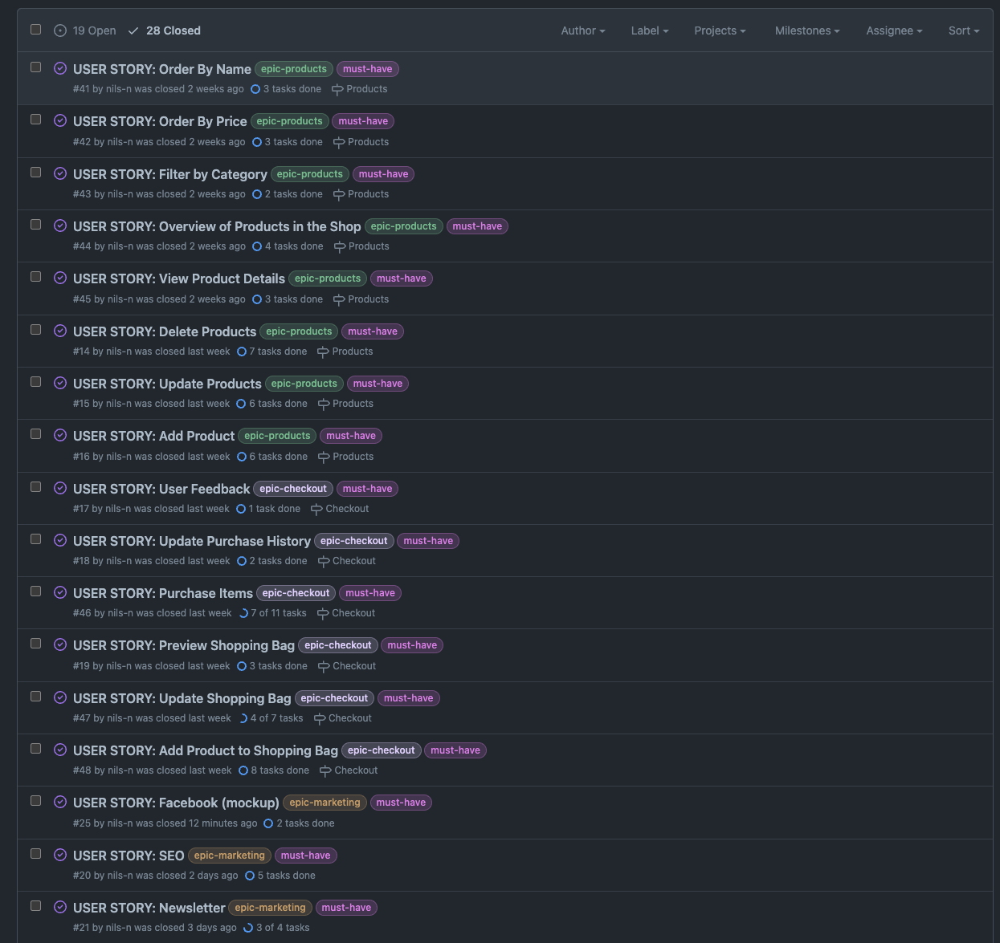 </td>
      </tr>
      <tr>
        <td >  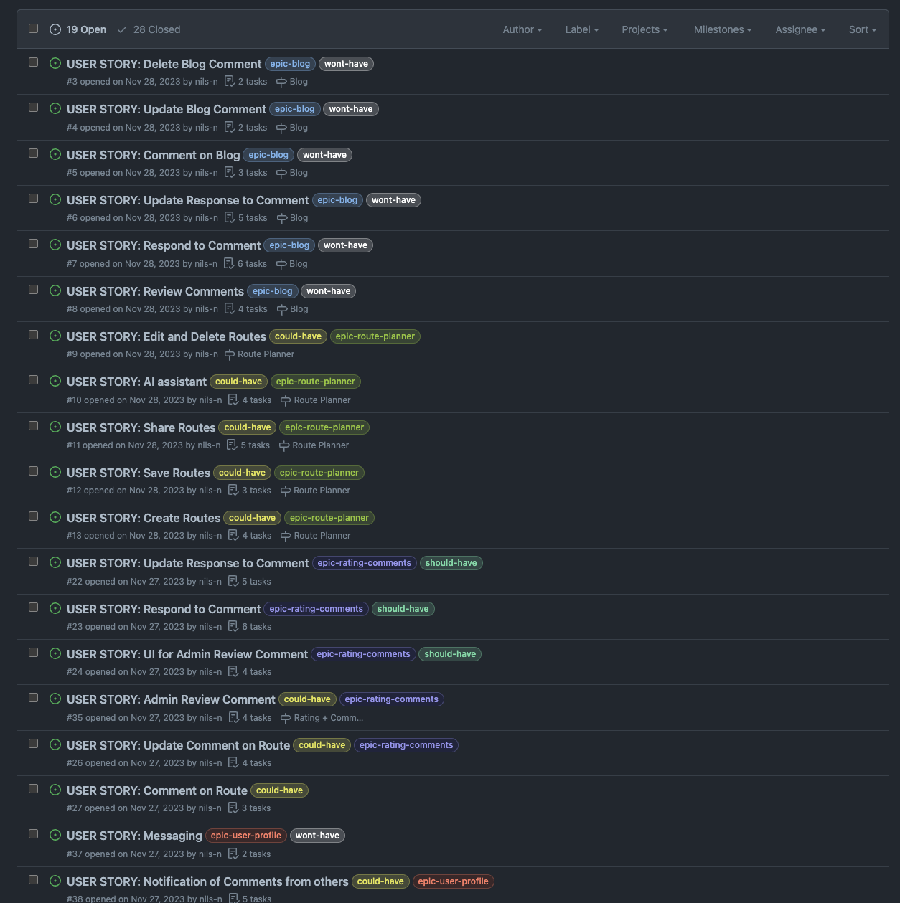 </td>
      </tr>
    </table>
</div>
<div style='text-align:center'>
     <table style='width:90%; content-align:center; '>
      <tr>
        <th colspan=2> GitHub Project Board </th>
      </tr> 
        <tr>
          <td >  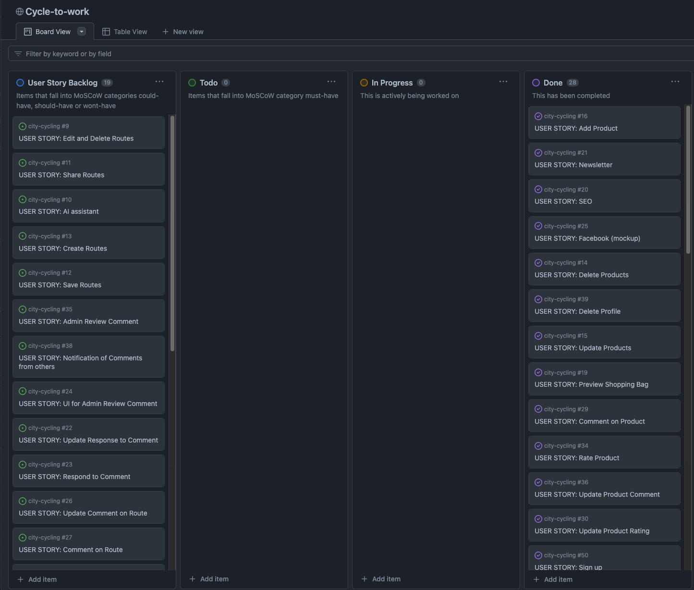 </td>
        </tr>
      </table>
  </div>
<div style='text-align:center'>
     <table style='width:90%; content-align:center; '>
      <tr>
        <th colspan=2> Example: Adding Acceptance Critera and Refining User Story into Tasks</th>
      </tr> 
        <tr>
          <td >  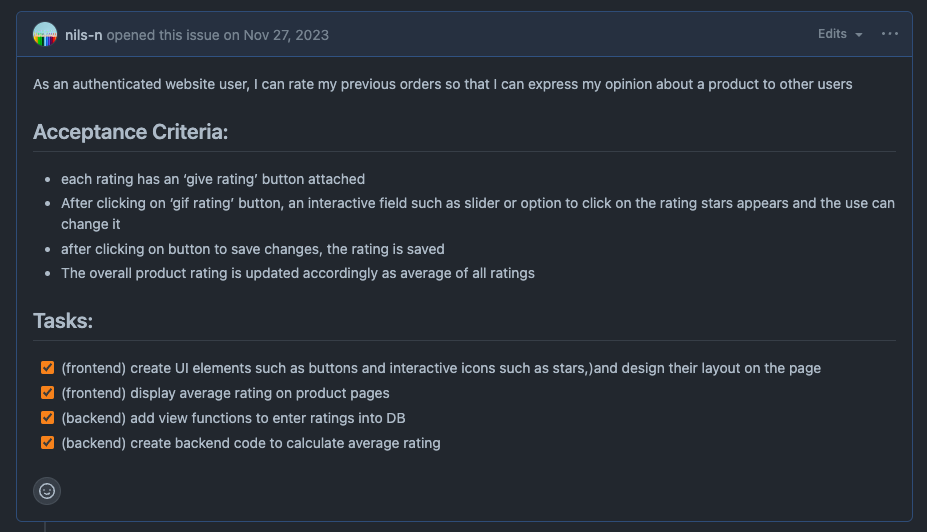 </td>
        </tr>
      </table>
  </div>

---

### Design

#### Color Scheme

A color scheme with a single primary color scheme (lime green) was selected from Tailwind's color system in order to create a clean theme of sustainability and nature. The use of colour was intentionally reduced in order to not distract the user's attention from the products in the shop.

The main color choices were:

- A light gray was chosen as background color to create a clean, professional tone and less aggressive than pure white
- For text and heading, shades of gray were carfefully selected from the Tailwind Color Palette to improve visual hierachy of the layout
- For accents, colors from the green and red spectrum were selected to contrast the rest of the color scheme in order to direct the attention of the user to these elements

<div style='text-align:center'>
   <table style='width:90%; content-align:center'>
      <tr>
        <th> Type </th>
        <th> Color </th>
        <th> Used for</th>
      </tr>
      <tr>
        <td> Primary </td>
        <td style='width:60%; height:40%; text-align:left'>  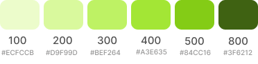 </td>
        <td> Landing Page,Hover States </td>
      </tr>
      <tr>
        <td> Secondary </td>
        <td  style='width:60%; height:40%; text-align:left'>   </td>
        <td> Background, Buttons, Text, Tables, Subheadings </td>
      </tr>
       <tr>
        <td> Accent </td>
        <td  style='width:60%; height:40%; text-align:left'>   </td>
        <td> Toasts, Warnings, Error, Info Messages </td>
      </tr>
    </table>
</div>

#### Typography

It was chosen to go with Tailwind's cross-browser `ui-sans-serif` font stack, taking into account that these system fonts get shipped with the brower and do not need to be imported explicitly, further decreasing page load time and therefore positively affect conversion rate of the shop.

For all text and headings of the website, the`font-sans` utility class from Tailwind CSS was applied, with a `font-size` depending on the screen size to ensure best readibility for all screens:

- Headings : `Sans-serif` 500/800 bold, 2.25rem/ 3rem/ 3.75rem , line-height 0.9
- Subheadings: `Sans-serif` 600 semibold, 2.25rem/ 2rem, line-height 1.5
- Text: `Sans-serif`, 400 light, 1.25rem/ 1.5rem, line-height 1.6

---

## Features

### General Features

The website consits of a landing page, a shop page, pages for product details, checkout and order detail page, a personal profile page, a 404/403 pages. All pages are responsive, designed using a mobile-first approach.

- `Landing Page` : this is the entry point where the website users arrive. From here, they can reach login/signup page to reach their personal page, visit the shop or navigate to their profile and check their order history, ratings and comments
- `Login/Signup Page` : New users can sign up with a username/password, and users who already signed up can login with their details entering their login credentials here.
- `Shop Page`: The main shop page where all various bike equipment products are listed as cards. The products can be sorted via categories, price or name in order for the user to find quickly their items. The average rating is displayed on each card. By default, products that belong to the current season are displayed when entering the shop (i.e. gloves and baselayers in the winter, sun glasses and shirts in the summer) based on real-world date.
- `Product Detail Page`: A page to display more details and to customize the purchase. Buttons are placed to select a desired size and quantity. All reviews and individual ratings of verified purchases are displayed below the product, and a button to place the product in the shopping bag. When the user has admin rights, buttons are added to either update details or to delete the product from the shop.
- `Product Admin Page`: Admins can edit details on this page for each product, by adapting the elements in the form and clicking on 'confim edit' button.
- `Shopping Bag Page`: A page to list all current items in the shopping bag. The user can adjust the quantity or delete items from the bag before clicking on the 'Secure Checkout' button that leads to the checkout page.
- `Checkout Page`: A page that lists all products contained in the order,including a summary and preview image of each item. There is a form for the user to enter the credit card details, and a 'Complete Order' button to confirm the purchase and start the payment via Stripe. If users are logged in , they can tick a checkbox and store their information so that this form is pre-filled in teh next purchase.
- `Profile Page`: On the profile page, users can add or edit their delivery address, and see list of links to previous purchases that they have done in the shop. For each item that they have purchased, they can give a rating by adjust the number on the stars next to the item. Optionally, they can leave a comment about their purchases that will be displayed for each user on the Product Detail Page.
- `403/404/500 Page`: Customized pages that handle errors such as typing in a wrong URL or trying to access a URL that they had no access rights for.

The landing page and the shop page is accessible for all users, whereas the Profile page can only be accessed by authenticated users after signing in with their credentials. The page to edit Product Details is only accesible for users with admin rights. Any attempt for unauthorized access redirects directly to the 403 error page (unauthorized access).

### Navbar

On top of each page, a navbar is placed leading to sites available to the user based on [Flowbite](https://flowbite.com/docs/components/navbar/)'s `navbar` component :

- When a user is not signed in: links are displayed to `Shop`, `Routes` and `Blog` `Login` , `Signup` and the `Shopping Bag` Page
- When a user is signed in: links are displayed to `Shop`, `Routes` and `Blog`, `Logout`, the personal `Profile` page and the `Shopping Bag` page. The Profile link is displayed as name of the signed-in user and directs to their individual profile page.
- On large screen, the main link is listed in the center of the screen, only the `Profile` and `Shopping Bage` page links are on top left on the navigation bar.
- On small screen, the navbar collaps to a Hamburger Button. When clicked, a list of links appears. Another click on the Hamburg Icon and the Hamburger Menu closes and returns to the collapsed state.

<div style='margin:auto 0;'>
   <table style='width:95%; margin:auto 0;'>
    <tr>
      <th colspan=2> Navigation Bar </th>
    </tr> 
      <tr>
        <th> Name </th>
        <th> Preview </th> 
      </tr>
      <tr>
        <td> Navbar (mobile)
        </td>
        <td  style=' vertical-align:top'>  
            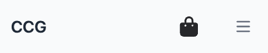 
        </td>
      </tr>
        <tr>
        <td> Navbar (mobile) expanded
        </td>
        <td  style=' vertical-align:top'>  
            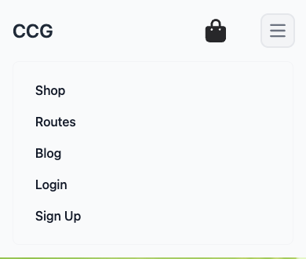 
        </td>
      </tr>
        <tr>
        <td> Navbar (Desktop)
        </td>
        <td  style=' vertical-align:top'>  
            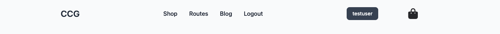 
        </td>
      </tr>
    </table>
</div>

### Landing Page

This site is the entry point and is accessible for all users.

- It shows a hero image with a person and a bike, a main heading of the page and two CTA buttons
- When a user is not signed in, the CTA buttons lead to `Go to Shop` and `Login` page to allow users fast access to the main functionality of the page
- When a user is signed in, the CTA buttons lead to the `Go to Shop` and the personal `Profile` page

<div style='margin:auto 0;'>
   <table style='width:95%; margin:auto 0;'>
    <tr>
      <th colspan=2> Landing Page </th>
    </tr> 
      <tr>
        <th> Mobile </th>
        <th> Desktop </th> 
      </tr>
      <tr>
        <td  style=' vertical-align:top'>  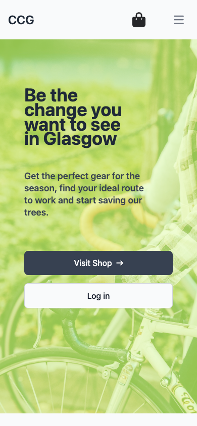 </td>
        <td  style='vertical-align:top'>   </td>
      </tr>
    </table>
</div>

### Login/Signup Page

- New users can sign up on the website using the Signup Form.
- If the username already exists, the user is prompted to choose a different, unique username
- If the password is too common, i.e. `password` or `1234` the user will be asked to provide a more safe password with instructions on minimal requirement for a safe password
- Users that have already signed up, can head to the Login page and enter their credentials
- If the combination of username/password is valid and exists in the DB, the user will be directed back to the home page
- If the password does not match or the username does not exist, the user will receive feedback that the provided combination has been invalid.

<div style='margin:auto 0;'>
   <table style='width:95%; margin:auto 0;'>
    <tr>
      <th colspan=2> Landing Page </th>
    </tr> 
      <tr>
        <th> Mobile </th>
        <th> Desktop </th> 
      </tr>
      <tr>
        <td  style=' vertical-align:top'>  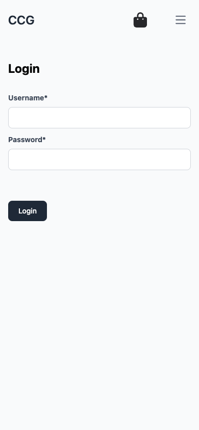 </td>
        <td  style='vertical-align:top'>  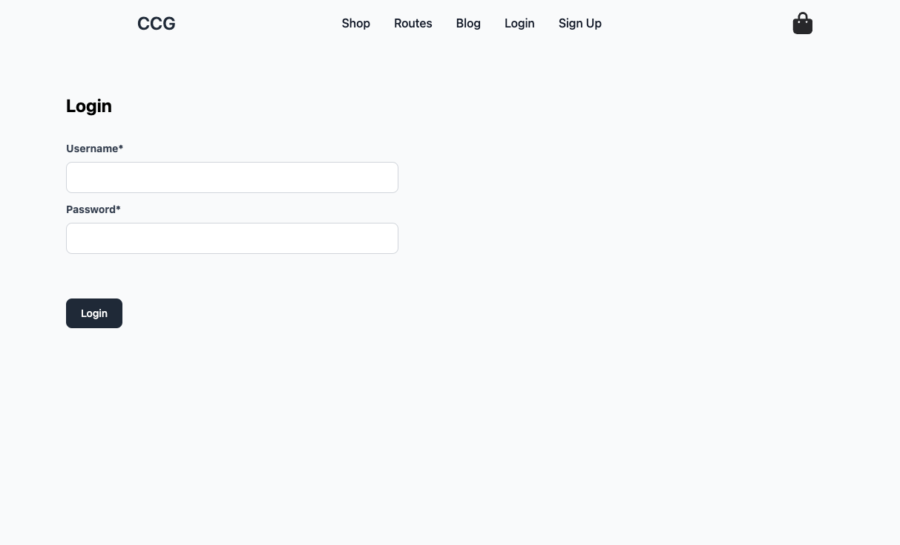 </td>
      </tr>
      <tr>
        <td  style=' vertical-align:top'>  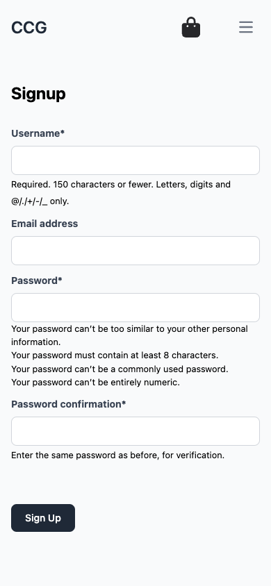 </td>
        <td  style='vertical-align:top'>  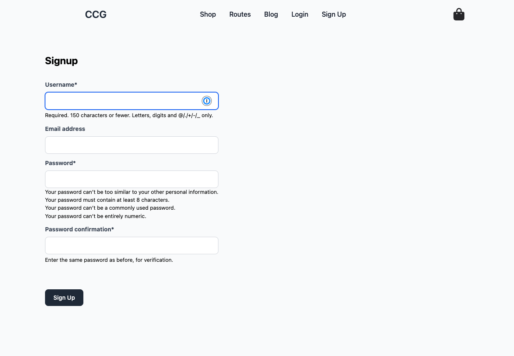 </td>
      </tr>
    </table>
</div>

### Profile Page

This is the page for signed-in users where they can update their delivery address, view their purchase history and find links to each order they have done in the shop.

- On this page, they can also give a rating and a comment to each product they have bought, which is then displayed to all users below the product.
- The average rating is updated either as average of all users that rated the product, or without rating if it has not been rated.
- They can also click on this page on the 'delete Profile' button to delete all personal information stored about (address, ratings, comments). A modal pops up to confirm the deletion warning the user that this operation cannot be made undone.

<div style='margin:auto 0;'>
   <table style='width:95%; margin:auto 0;'>
    <tr>
      <th colspan=2> User Profile Page </th>
    </tr> 
      <tr>
        <th> Mobile </th>
        <th> Desktop </th> 
      </tr>
      <tr>
        <td  style=' vertical-align:top'>  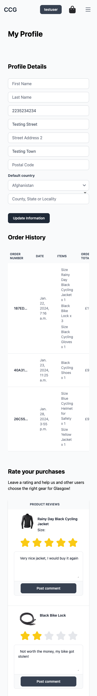 </td>
        <td  style='vertical-align:top'>   </td>
      </tr>
    </table>
</div>

### Shop Page

This is the page to display all items in the shop.

- By default, products of the current season are displayed (i.e. gloves and rain jackets in the autumn and summer gloves/short cycling trousers in the summer).
- Users can sort and filter the products by categories, name, and price in order to find quickly what they are searching for
- Each product card contains a preview image, the price, the average rating. Clicking on a card leads to the product detail page for this item

<div style='margin:auto 0;'>
   <table style='width:95%; margin:auto 0;'>
    <tr>
      <th colspan=2> Shop Page </th>
    </tr> 
      <tr>
        <th> Mobile </th>
        <th> Desktop </th> 
      </tr>
      <tr>
        <td  style=' vertical-align:top'>  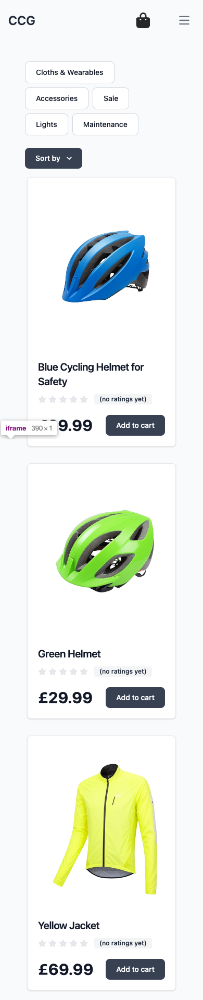 </td>
        <td  style='vertical-align:top'>  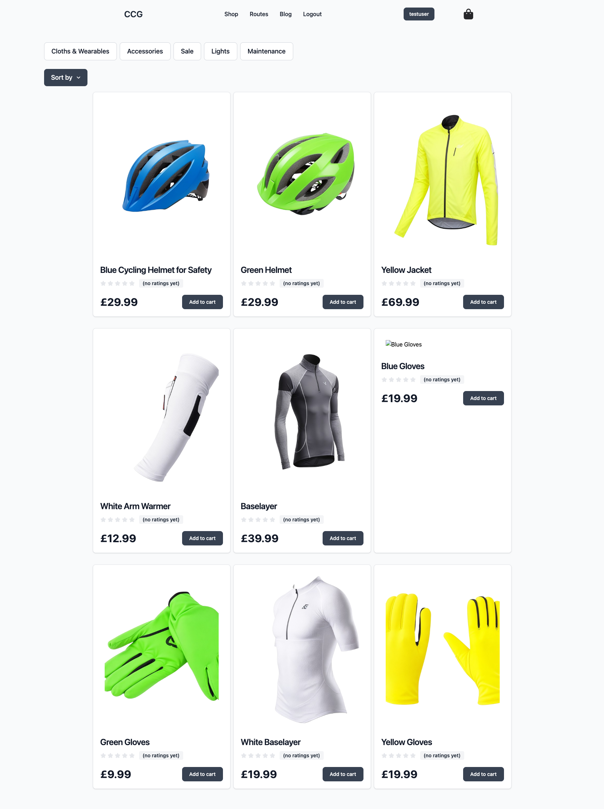 </td>
      </tr>
    </table>
</div>

### Product Detail Page

This is the page to display details for a selected product.

- In addition to the main visual elements (product name, price and preview image), a short description is display
- The users can select a size and quanitity. When clicking on 'add to Bag' button, the selected size and quantity is added to the shopping bag.
- On the bottom of the page, each individual comment and rating is displayed that other users have given for the selected product.
- User can also get back to the shop also via clicking a 'back to shop' button or by clicking on the 'shop' item in the navbar

<div style='margin:auto 0;'>
   <table style='width:95%; margin:auto 0;'>
    <tr>
      <th colspan=2> Product Details Page </th>
    </tr> 
      <tr>
        <th> Mobile </th>
        <th> Desktop </th> 
      </tr>
      <tr>
        <td  style=' vertical-align:top'>  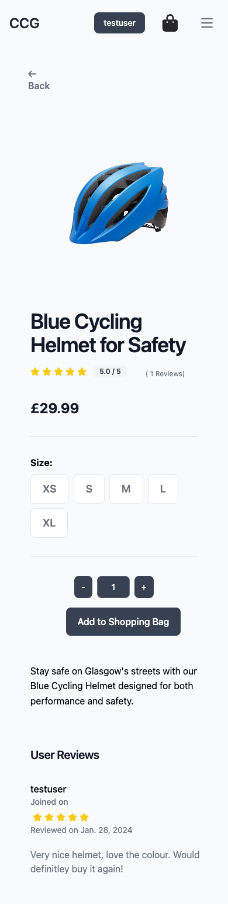 </td>
        <td  style='vertical-align:top'>  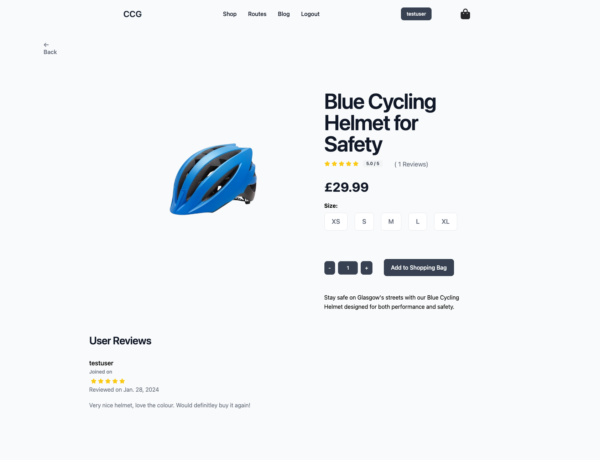 </td>
      </tr>
    </table>
</div>

### Shopping Bag Page

This page summarizes all elements that the user has in their shopping bag

- Users see the slected size, quantity and a preview image of each item. They can update or delete items from the bag by clicking the respective buttons
- The bag total and the grand total (incl. delivery costs) are displayed below the bag summary
- A link to 'Secure Checkout' is listed on the bottom of the page where they will be directed to the page to checkout and place their order

<div style='margin:auto 0;'>
   <table style='width:95%; margin:auto 0;'>
    <tr>
      <th colspan=2> Shopping Bag Page </th>
    </tr> 
      <tr>
        <th> Mobile </th>
        <th> Desktop </th> 
      </tr>
      <tr>
        <td  style=' vertical-align:top'>  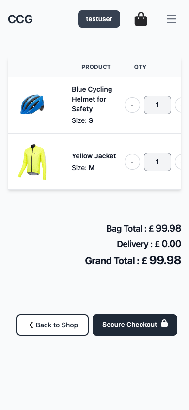 </td>
        <td  style='vertical-align:top'>  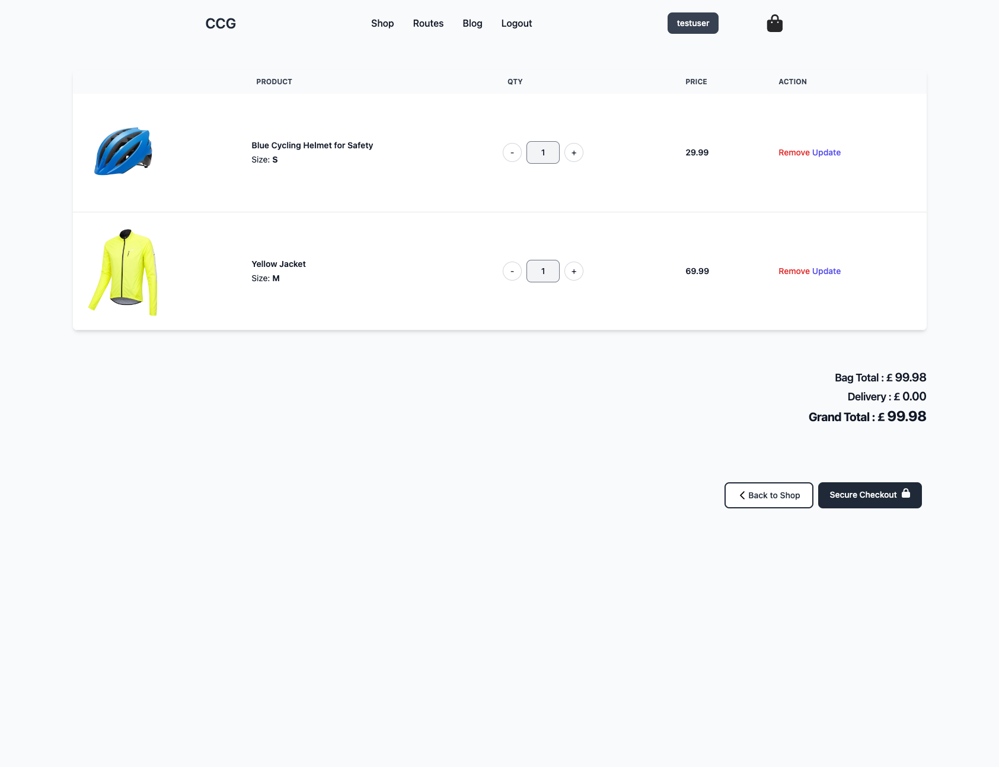 </td>
      </tr>
    </table>
</div>
  
### Checkout Pages

This page summarizes the content of an order and allows the user to finally place the order.

- The usesr can enter their delivery information. If they are logged in , they have the option to save the delivery address to their profile by ticking the checkbox on the form
- Once the delivery address and card detail are valid, the users can click on the 'Complete Order' button and send the order to Stripe.
- A loading screen indicates to the user that the payment is in process. Once the payment is confirmed, the order is stored in the database, and the user receives a confirmation email. The user is then redirected to the checkout success page. Logged-in users can find a link to this page on their profile page.

<div style='margin:auto 0;'>
   <table style='width:95%; margin:auto 0;'>
    <tr>
      <th colspan=2> Checkout Page </th>
    </tr> 
      <tr>
        <th> Mobile </th>
        <th> Desktop </th> 
      </tr>
      <tr>
        <td  style=' vertical-align:top'>  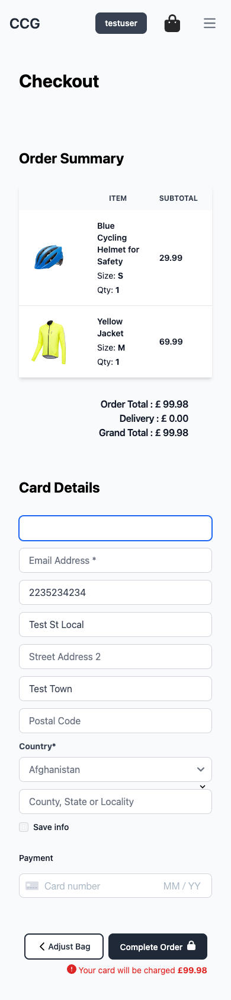 </td>
        <td  style='vertical-align:top'>  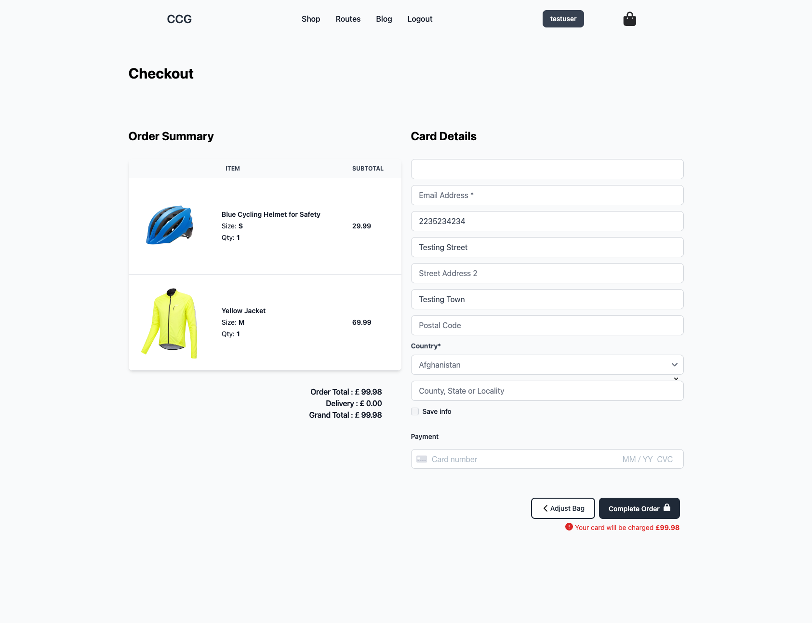 </td>
      </tr>
    </table>
</div>

### Other Pages

These pages contain a friendly message when the 404 and 403 server error has occured.

- 404 page: appears when the user enters a URL that does not exist
- 403 page: appears when users try to enter a site that they have no authorization for

<div style='margin:auto 0;'>
     <table style='width:95%; margin:auto 0;'>
      <tr>
        <th colspan=2> Checkout Page </th>
      </tr> 
        <tr>
          <th> Mobile </th>
          <th> Desktop </th> 
        </tr>
        <tr>
          <td  style=' vertical-align:top'>  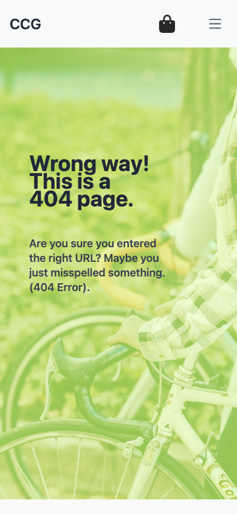 </td>
          <td  style='vertical-align:top'>  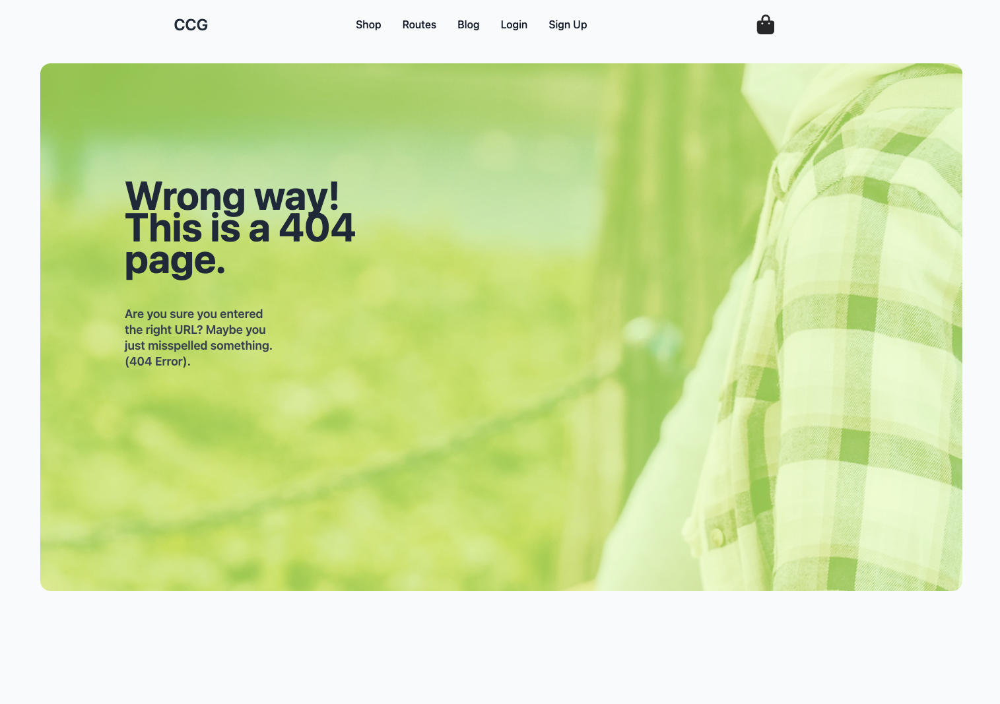 </td>
        </tr>
        <tr>
          <td  style=' vertical-align:top'>  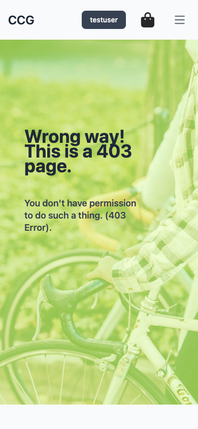 </td>
          <td  style='vertical-align:top'>   </td>
        </tr>
      </table>
  </div>

---

## Marketing Strategies

### Social Media

A Facebook mockup page was created for the shop that would aim to increase attention on social media if the shop was not fictious. It was decided to not create actual implementation as Facebook does not allow fake businesses.

<div style='text-align:center'>
   <table style='width:90%; content-align:center; '>
      <tr>
        <th colspan=2> Facbook Mockup Page  </th>
      </tr> 
       <tr>
        <td > 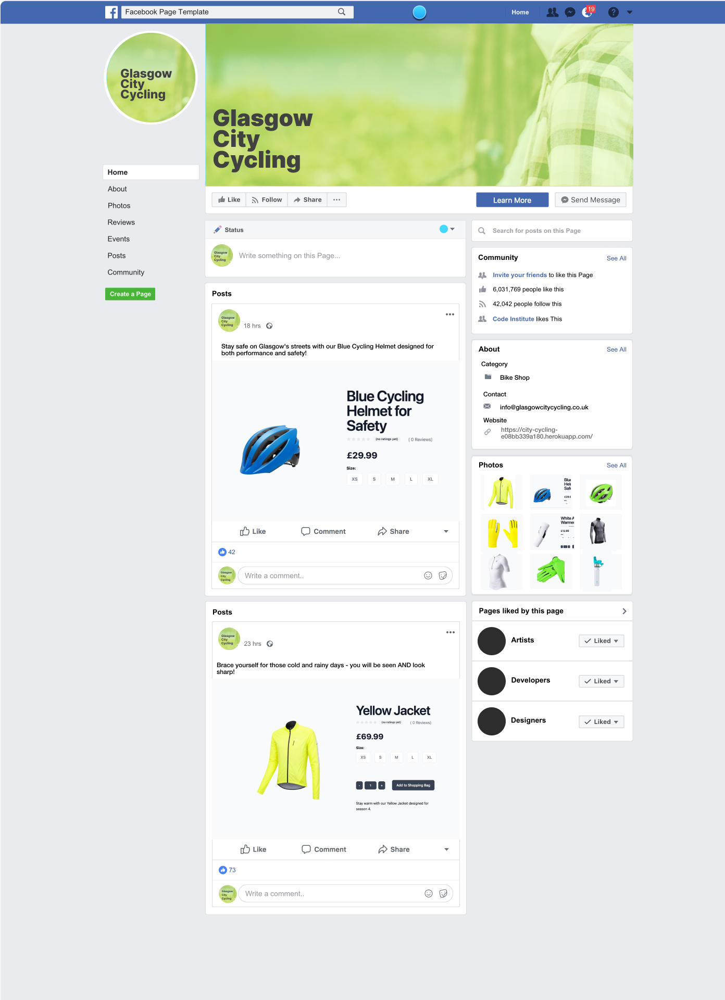 </td>
      </tr>
    </table>

</div>

### Newsletter

A signup form for a newsletter was added using [Inuit Mailchimp](https://mailchimp.com/) to the site where the user can sign up for a newsletter to receive offers.

<div style='text-align:center'>
   <table style='width:90%; content-align:center; '>
      <tr>
        <th colspan=2> Newsletter Signup (Desktop/Mobile Screen) </th>
      </tr> 
       <tr>
        <td > 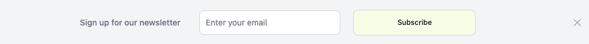 </td>
      </tr>
      <tr>
        <td > 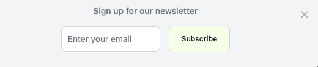 </td>
      </tr>
    </table>
</div>

---

## SEO

The main focus in terms of SEO was put on creating an accessible, high-quality website that creates value to the user following the principle 'content is king'. Semantic HTML was used throughout the pages to convey intention and make the site rank high on search engines.

A `sitemap.xml` was created using [XML-Sitemaps](https://www.xml-sitemaps.com/) and added to the page in order to help search engines classify the site as high-quality, together with a `robots.txt` for this site .

### Keywords

While a focus was to put on reducing keyword-stuffing, a set of steps was applied to create a succint list of well-matched keywords. Fisrt, short-tail keywords was created how users may search for this website:

1. Bike accessories
2. Cycling gear
3. Bike lights
4. Bike helmets
5. Cycling clothes
6. Maintenance tools
7. Bike locks
8. Bike racks
9. Repair kits
10. Bike pumps
11. Cycling shoes
12. Bicycle accessories
13. Urban cycling gear
14. Mountain biking equipment
15. Commuter bike accessories
16. Road cycling gear
17. Bike safety items

Next, this list was refined to create a shorter list of long-tail keywords:

1. "Bike lights for night cycling"
2. "Waterproof cycling jacket for women"
3. "Maintenance kit for bikes"
4. "Best road bike helmets under £100"
5. "Cycling shoes with SPD cleats"
6. "Commuter bikes equipment in Glasgow"
7. "Urban cycling clothes for men"
8. "Repair kit for punctured tires in Glasgow"

These keywords were then put into google search and it was noted down what the search engine wrote under 'People also ask' and 'Related Searches' as well as google search suggestions in the inbox element in order to further refine the keywords.

<div style='text-align:center'>
   <table style='width:90%; content-align:center; '>
      <tr>
        <th colspan=2> Keyword Refinement  </th>
      </tr> 
       <tr>
        <td >  </td>
      </tr>
      <tr>
        <td > 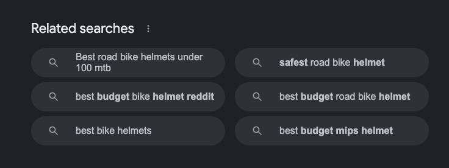 </td>
      </tr>
      <tr>
        <td > 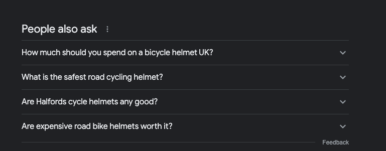 </td>
      </tr>
       <tr>
        <td > 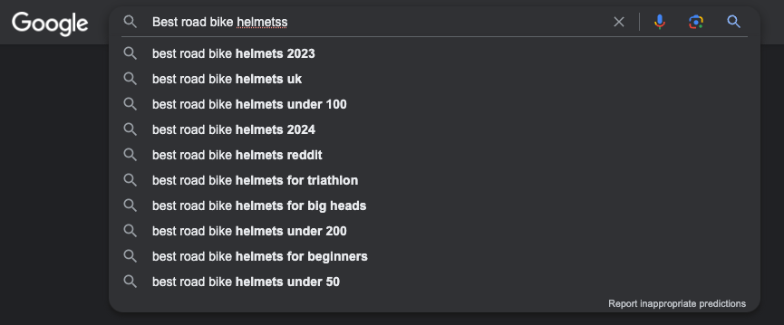 </td>
      </tr>
    </table>
</div>

The most promising long-tail keywords were then tested using [wordtracker](https://www.wordtracker.com/). Those keywords with a high volume and relatively low competition were then included in the site's metadata.

<div style='text-align:center'>
   <table style='width:90%; content-align:center; '>
      <tr>
        <th colspan=2> Keyword Refinement  </th>
      </tr> 
       <tr>
        <td > 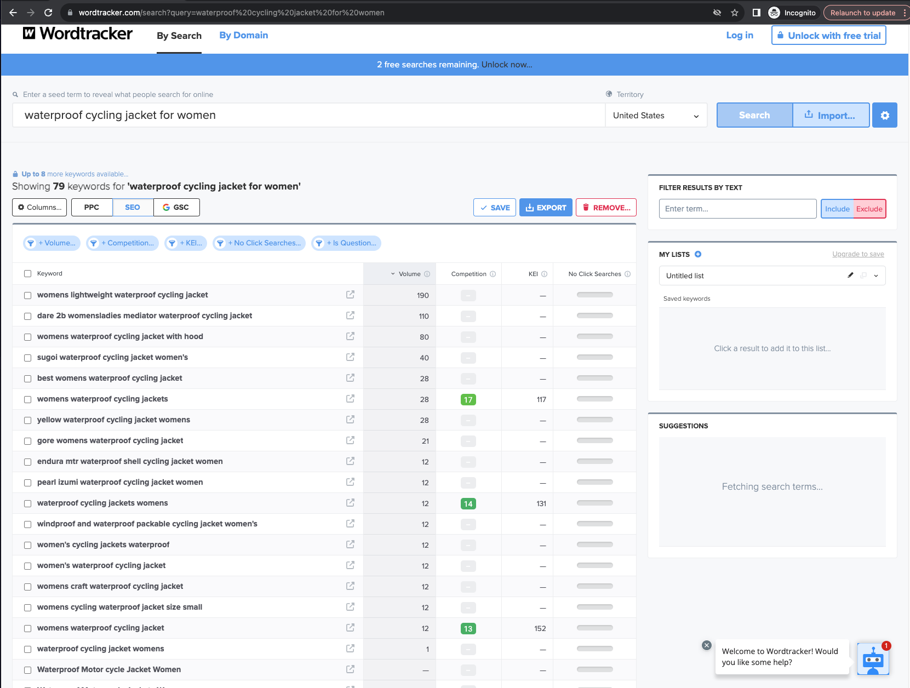 </td>
      </tr>
    </table>
</div>

---

## Logic and Flow Diagrams

### Landing Page

On the main page, users can:

- login with their credentials if they are already signed up
- signup and create a new profile. If the credentials are valid, they are redirected to the login


### Shop Page

On the shop page, users can

- (optionally) select a filter to display only a desired subset of the products
- (optionally) select a sort criteria to sort the results, of the either filtered or unfiltered product list
- When they click on a card, they are directed to the product detail page where they need to select a size and a quantity before they can add the product to the shopping bag when pressing the corresponding button


### Profile Page

On the profile page, users can:

- see a list of products that they have purchased in the past
- (optionally) they can either give a new rating or set a new rating for a purchased product. This updates the overall average rating of the product
- (optionally) they can give a new comment or edit their current comment on a purchased product. The comment will then be listed on the product detail page. By default, the comments are approved but admin has the opportunity to set the `is_approved` field to `False`.

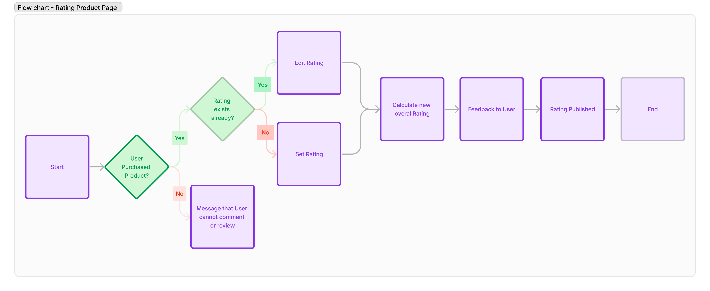
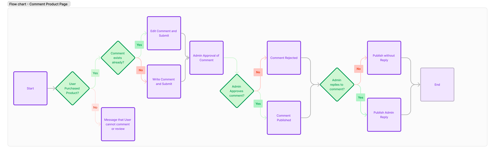

---

## Models

User data are stored in a relational database. The main model has been carefully designed to allow for products, placing orders, commenting on purchases, rating of purchases and an option for displaying seasonal products :

- **CustomUser**: each row is a user that has signed up on the website
- **Product**: each row is a product in the shop
- **Product Category**: each row is a category that a product could belong to
- **Product Season**: each row is a season that a product could belong to
- **Order**: each row is an order that has successfully been checked out
- **OrderItem**: each row is a product that belongs to a specific order
- **Comment** each row is a comment that a user has submitted for a purchased product
- **Rating** each row is a rating that a user has submitted for a purchased product

<table style='width:90%; content-align:center'>
    <tr>
       <td> 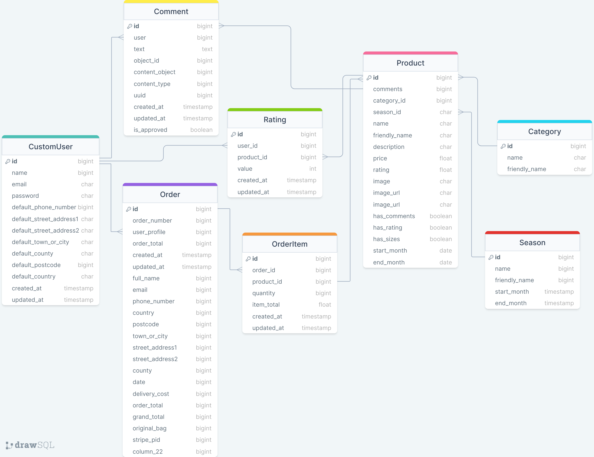  </td>
    </tr>
</table>

---

## Wireframes

Wireframes were created in [Figma](https://www.figma.com/), using a mobile-first approach using components from the [Flowbite](https://flowbite.com/) library for Tailwind CSS. Wireframes were created for:

<div style='margin:auto 0;'>
   <table style='width:95%; margin:auto 0;'>
    <tr>
      <th colspan=2> Wireframes - Product Page </th>
    </tr> 
      <tr>
        <th> Mobile </th>
        <th> Desktop </th>
      </tr>
      <tr>
        <td  style=' vertical-align:top'>  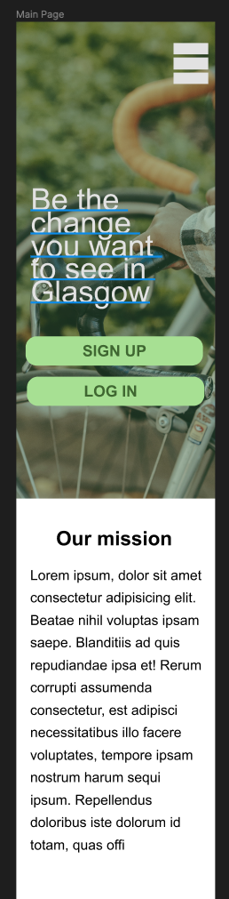 </td>
        <td  style='vertical-align:top'>  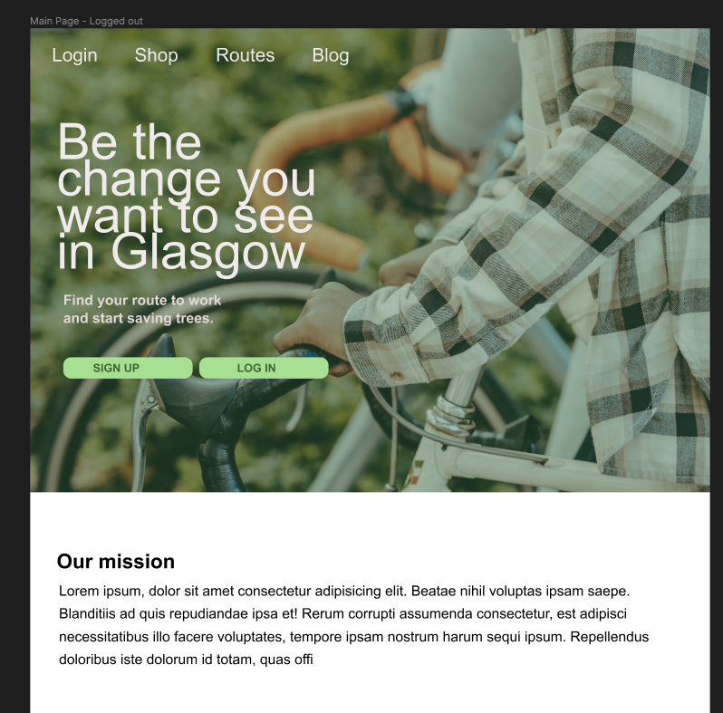 </td>
      </tr>
    </table>
</div>

<div style='margin:auto 0;'>
   <table style='width:95%; margin:auto 0;'>
    <tr>
      <th colspan=2> Wireframes - Product Page </th>
    </tr> 
      <tr>
        <th> Mobile </th>
        <th> Desktop </th>
      </tr>
      <tr>
        <td  style=' vertical-align:top'>  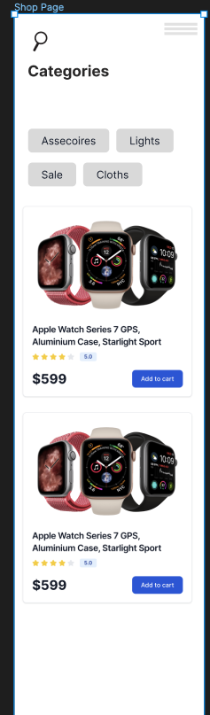 </td>
        <td  style='vertical-align:top'>  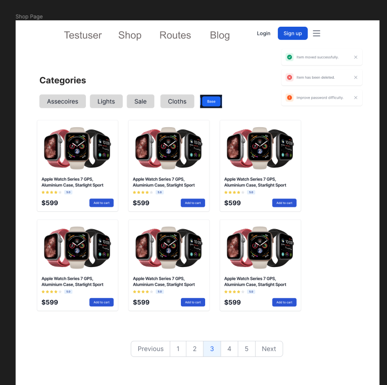 </td>
      </tr>
    </table>
</div>

<div style='margin:auto 0;'>
   <table style='width:95%; margin:auto 0;'>
    <tr>
      <th colspan=2> Wireframes - Product Details Page </th>
    </tr> 
      <tr>
        <th> Mobile </th>
        <th> Desktop </th>
      </tr>
      <tr>
        <td  style=' vertical-align:top'>  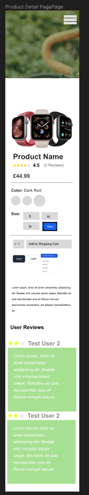 </td>
        <td  style='vertical-align:top'>  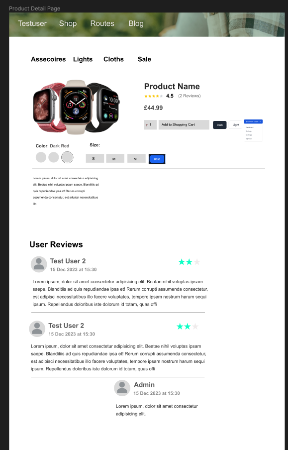 </td>
      </tr>
    </table>
</div>

<div style='margin:auto 0;'>
   <table style='width:95%; margin:auto 0;'>
    <tr>
      <th colspan=2> Wireframes - Shopping Bag Page </th>
    </tr> 
      <tr>
        <th> Mobile </th>
        <th> Desktop </th>
      </tr>
      <tr>
        <td  style=' vertical-align:top'>  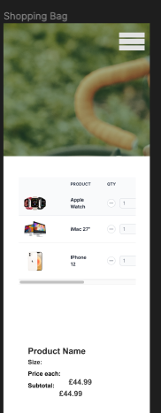 </td>
        <td  style='vertical-align:top'>  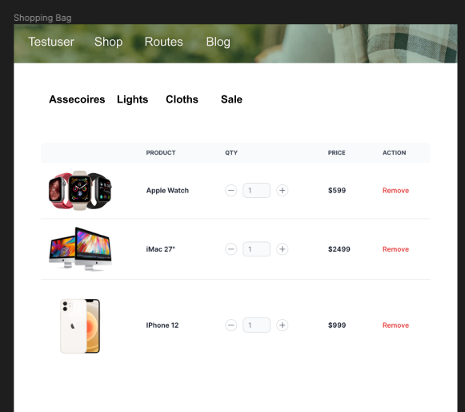 </td>
      </tr>
    </table>
</div>

<div style='margin:auto 0;'>
   <table style='width:95%; margin:auto 0;'>
    <tr>
      <th colspan=2> Wireframes - Order Confirmation Page </th>
    </tr> 
      <tr>
        <th> Mobile </th>
        <th> Desktop </th>
      </tr>
      <tr>
        <td  style=' vertical-align:top'>  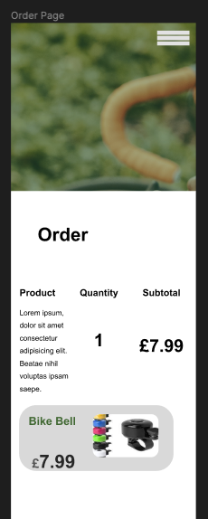 </td>
        <td  style='vertical-align:top'>  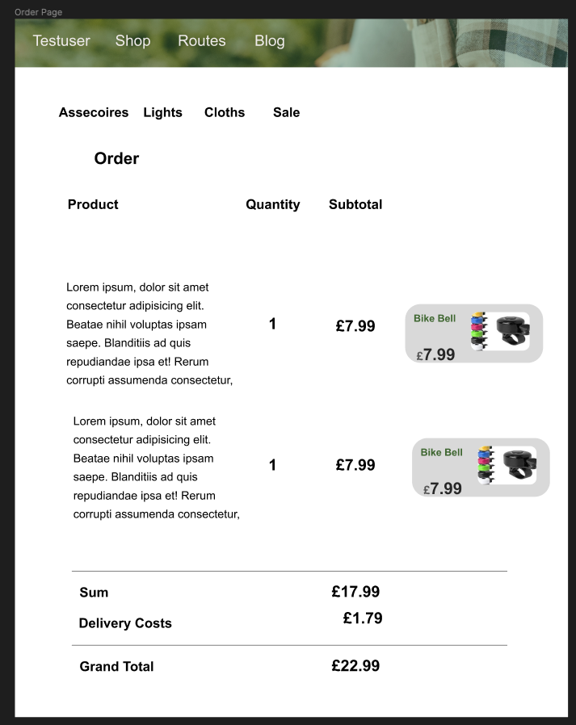 </td>
      </tr>
    </table>
</div>

---

## Future Implementations

- The next iteration will include a blog that allows the page owner to produce high-quality content about cycling in Glasgow, allowing users to interact with other cyclists and foster a community of cyclists in Glasgow
- Another iteration will consist of a routing page where users can share, discuss and present their best routes to work in Glasgow. The database used in this iteration is already designed for this purpose, including a generic `Comment` model that is based on the `ContentType` model. This model allows user comments on any model type using `GenericForeinKeys` , and comments are therefore not only constraint to purchases by design.
- Sortings on the products based on rating (ie.e. avg. rating from high to low, show only items with 4 stars and above on average)

---

## Accessibility

All pages were designed with accessibility in mind for website users that require screen reading tools:

- semantic html such as `<main>`, `<nav>` and `<header>` were used across all pages to express a clear intent of all page elements
- all headings `<h1>-<h3>` were used with the purpose to clearly organize the content (and not for styling) and to convey clear page structures
- All buttons and links have a matching `aria-label` that explains its purpose
- Additional headings and spans are added with a `sr-only` label in order to give more context to sections and buttons
- Color Contrast has been thoroughly tested to ensure a minimum colour contrast of all background-text pairs of at least `4.5:1`

---

## Technologies Used

- [DrawSQL](https://drawsql.app/) to draw ERD diagram for the DB tables
- Git / [Github](https://github.com/) for Version Control
- [VS Code ](https://code.visualstudio.com/) as local IDE
- [Figma](https://www.figma.com/) for Wireframs and Flowcharts
- [Shields.io](https://shields.io/) for Readme badges
- convert markdown tables to html via [HTML Table Converter](https://tableconvert.com/markdown-to-html)
- [Prettier](https://marketplace.visualstudio.com/items?itemName=esbenp.prettier-vscode) VS Code formatter
- [icecream](https://github.com/gruns/icecream) more expressive alternative to python's `print` method
- [ruff](https://docs.astral.sh/ruff/) for python code formatting
- [djlint](https://www.djlint.com/) for html formatting with django tags
- [Flowbite](https://flowbite.com/) components for Tailwind CSS
- [XML-Sitemaps](https://www.xml-sitemaps.com/) to create a sitemap.xml file
- [Wordtracker](https://www.wordtracker.com/) for keyword refinement
- [Inuit Mailchimp](https://mailchimp.com/) for newsletter signup functionality
- [Eagle](https://eagle.cool/store) to capture page previews and organize assets
- [Leonardo.ai](https://leonardo.ai/) to generate fake preview images for the products in the shop

### Languages

- HTML
- CSS
- Python
- Javascript

### Frameworks

- [Django](https://www.djangoproject.com/) for the backend server functionality
- [Tailwind CSS](https://tailwindcss.com/) for frontend functionality
- [Tailwind - Flowbite](https://flowbite.com/) as basis for UI components
- [pytest](https://docs.pytest.org/en/7.4.x/) for python unit tests
- [Stripe](https://stripe.com/en-de) for Payments

---

## Deployment

The deployment consists of 4 steps :

1.  setting up backend DB (PostgreSQL)
2.  setting up host for static files (AWS)
3.  setting up Heroku app and connect to DB and AWS
4.  setting up payments via Stripe

### Setup for DB (PostgreSQL)

- Create ElephantSQL account (if needed) and login on website
  - click on `create New Instance` and choose a name (recommend not using `-` or `.` in the name - that seems to cause issues)
  - use `Tiny Turtle` plan, leave Tags empty. Then select region
  - enter the new project from dashboard and copy the URL into your `env.py` template of the `DATABASE_URL` variable
- open the `settings.py` of your main django project and update the `DATABASE_URL`

```python

 DATABASES = {
     'default': dj_database_url.parse(os.environ.get("DATABASE_URL"))
 }
```

- To confirm that we can now connect to the BD hosted on ElephantSQL, Run the migration command in your terminal to migrate your database structure to the newly-connected ElephantSQL database

```
python manage.py makemigrations
python manage.py migrate
```

### Setup for AWS (Static Files)

- Create AWS account (if needed) and login to `S3` on their website
- click on `create bucket` and choose a name, ensure to set `ACLs enabled`
- search for the `properties` tab for `static website hosting` and adapt `permissions` and `policies` to configure your bucket settings
- Create a new IAM user group and a new User, and attach the permissions policy you created earlier to this group
- Retrieve your access keys by downloading the `.csv` file containing the access keys for the user created before (`AWS_ACCESS_KEY_ID` and `AWS_SECRET_ACCESS_KEY`)
- In the Django App, ensure to serve static files using AWS when the site is deployed. This is done by creating a new environment variable `USE_AWS` this is set to `FALSE` during development and `True` in the deployed version
- create a public read-only `media` directory that will contain the static media files to be hosted in the bucket

### Setup for Heroku

Login to Heroku Website and Create a new App (EU)

- Connect the App with your GitHub Repository on the Heroku Website
- a `SECRET_KEY` can be generated and copied from here [Django Secret Key Generator](https://miniwebtool.com/django-secret-key-generator/)
- the `DATABASE_URL` is taken from your ElephantSQL project as described above (copy entire `URL`)
- for writing static files on `AWS` copy access keys from your `.csv` file
- Go to `Settings > Config Vars` and enter your secret environment variables from your `env.py` using the following variables:

```python
  SECRET_KEY=SECRET_KEY
  DATABASE_URL=DATABASE_URL
  USE_AWS=USE_AWS
  AWS_ACCESS_KEY_ID=AWS_ACCESS_KEY_ID
  AWS_SECRET_ACCESS_KEY=AWS_SECRET_ACCESS_KEY
  STRIPE_PUBLIC_KEY=STRIPE_PUBLIC_KEY
  STRIPE_SECRET_KEY=STRIPE_SECRET_KEY
  STRIPE_WH_SECRET=STRIPE_WH_SECRET
  PORT=8000
  DEBUG=False
```

### Setup for Stripe

- Create Stripe account (if needed) and switch to `Developer` tab on their website
- Click on `API Keys` and copy both the `STRIPE_PUBLIC_KEY` and `STRIPE_SECRET_KEY` into your environment variables
- If you want to test webhooks, you can also add the `STRIPE_WH_SECRET` to your variables but it is not necessary to handle payments on the deployed site
- add those keys to `settings.py` and extract them via environment variables (make sure to not hard-code your keys here as the settings file is publicly available on Github)

### How to Fork

- Log into GitHub and navigate to this repository
- Click on the "Main" Branch button and type the name of the forked branch
- Click on "Create Branch" to confirm

### How to Clone

- Click on the "Code" button and copy the link to this repository
- open terminal on your machine and navigate to the folder you want to store a local copy
- in the terminal, type 'git clone ' followed by the link you copied
- press enter to confirm

---

## Testing

This website was tested using a mix of manual and automated tests for several apsects of this Django application. The results were documented in [TESTING.md](./TESTING.md). The testing scope was:

- Authentication
- Functionality
- Usability
- Accessibility
- Synatx
- Accessibility

All of the `pytest` test cases were also integrated in a [GitHub actions](https://github.com/features/actions) workflow that runs all tests for each pull request and push to the main branch, spotting erros in the code when submitting a Pull Request.

#### Limitation

The coverage of the automated tests were below the percentage that I was aiming for when I started testing. There was simply not enough time left in the timebox for this first iteration to create the `MVP`. In a future iteration, this percentage will be increased to cover more edge cases and to make the application more robust.

---

### Solved Bugs

- Bug: Static Files would not be served properly on the deployed version. All advises from our slack channel or Stackoverflow standard did not seem apply on this issue (i.e. removing `DISABLE_COLLECTSTATIC` from the environment variables). It was in the end caused by mis-spelling the variable `settings.DEFAULT_STORAGE`
<div style='text-align:center'>
    <table style='width:90%; content-align:center'>
       <tr>
       <th> Before</th>
       <th> After</th>
      </tr>
       <tr>
      <td> 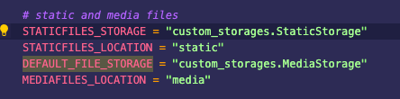  </td>
      <td> 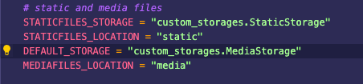  </td>
      </tr>
    </table>
</div>

**Solution** : Rename the wrong variable `settings.DEFAULT_FILES_STORAGE` into the correct name `settings.DEFAULT_STORAGE`. After renaming, static files would be served by AWS.

- Bug: When only a few items were in the shopping bag, the total grand for an order would be much too high, with a grand total that was too high.

<div style='text-align:center'>
    <table style='width:90%; content-align:center'>
       <tr>
       <th> Description</th>
       <th> Image</th>
      </tr>
       <tr>
        <td style='width:33%; content-align:center'>Problem: Wrong Grand Total of a bag item  </td>
        <td> 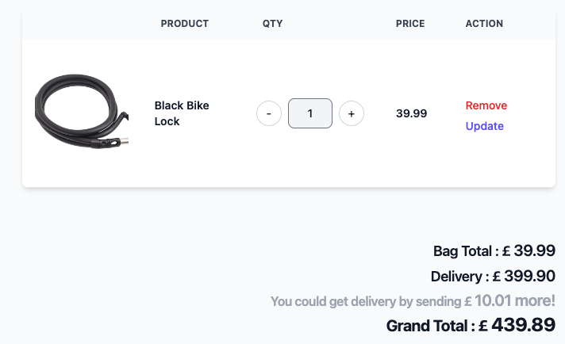  </td>
      </tr>
      <tr>
        <td>Diagnois: Bag items and quantities are are correct, but delivery costs are wrong  </td>
       <td> 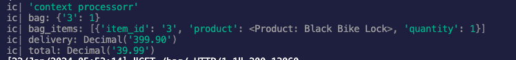  </td>
      </tr>
      <tr>
        <td>Solution: in the backend, Dividing the delivery costs by factor of 100 to correct for storing costs as Decimals </td>
        <td> 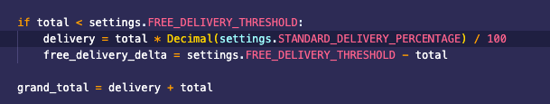  </td>
      </tr>
    </table>
</div>

- Bug: The test webhooks would respond with a 400 server error
  <div style='text-align:center'>
    <table style='width:90%; content-align:center'>
       <tr>
       <th> Problem: Stripe WH repsonds with 500</th>
      </tr>
       <tr>
      <td> 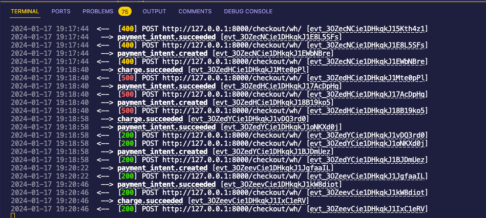  </td>
      </tr>
    </table>
</div>

**Solution** I simply forgot to add an environment variable `STRIPE_WH_SECRET`. Adding this to `settings.STRIPE_WH_SECRET`, and the POST requests responded with 200 status code.

- Bug: While testing pages that send messages via the `django.contrib.messages` , `pytest` would flag a `MessageFailure` error as this framework (and for that matter the standard unit testing framework too) and fail the test.
  <div style='text-align:center'>
      <table style='width:90%; content-align:center'>
         <tr>
          <th> Description </th>
          <th> Image </th>
         </tr>
         <tr>
          <td>Error Message: pytest cannot access messages Middleware </td>
          <td> 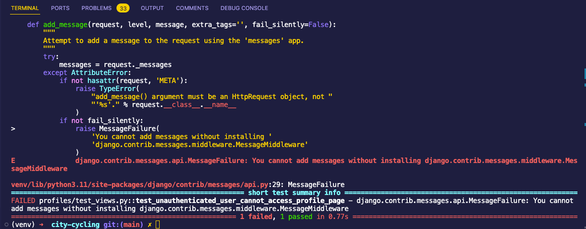  </td>
         </tr>
         <tr>
          <td> Solution: Allow message system to fail silently </td>
          <td> 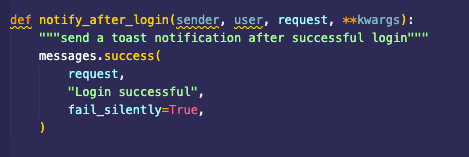  </td>
         </tr>
      </table>
  </div>

  **Solution** The final cue to solve this problem was found on the third answer of [Stackoverflow - Why don't my Django unittests know that MessageMiddleware is installed?](https://stackoverflow.com/questions/11938164/why-dont-my-django-unittests-know-that-messagemiddleware-is-installed) that pointed to the right location in the Django documentation: [Failing silently when the message framework is disabled](https://docs.djangoproject.com/en/dev/ref/contrib/messages/#failing-silently-when-the-message-framework-is-disabled) : Adding the keyword `fail_silently` to each `django.messages` solved the issue and made the tests pass.

---

### Open Bugs

---

## Credits

### Code Used

- User and Login/Logout functionality using a Custom User Model : [LearnDjango - Django Best Practices: Custom User Model](https://learndjango.com/tutorials/django-custom-user-model)
- Cookie setup for handling CSRF Tokens when using AJAX [Github](https://github.com/realpython/django-form-fun/blob/master/part1/main.js) as referenced in this blog post [Django and AJAX Form Submissions – Say 'Goodbye' to the Page Refresh](https://realpython.com/django-and-ajax-form-submissions/)

### Content

- All of the content was written by myself.
- Externally used code (such as code snippets from stackoverflow) in this project are referenced in this Readme and inside the HTML / CSS / JS / Python source code.

# Acknowledgements

- Teaching and Support from Code Insitute [Code Insitute](https://codeinstitute.net/)
- Convert Excel Tables (User Stories) into Markdown format [Link to TableConvert](https://tableconvert.com/)
- Images from [Pexels](https://pexels.com/) using [this image](https://www.pexels.com/photo/diverse-girlfriends-riding-bicycles-on-street-5965721/) for background image on landing page
  - Photographer : [Charlotte May](https://www.pexels.com/@charlotte-may/)
- Example Readme from Kera Cudmore [Kera's Github](https://github.com/kera-cudmore/readme-examples/blob/main/milestone1-readme.md)
- How to use factoryboy with pytest for testing functions (Very Academy) [Pytest | Django | Introducing Factory Boy and Faker - Fixture Replacement](https://youtu.be/qrvqNdCDKjM?feature=shared)
- Setup of automatic tests using Github Actions and pytest
  - Okken, Brian. "Python Testing with pytest." (2nd ed.) Pragmatic Bookshelf, 2022.
  - Automated Testing in Python with pytest, tox, and GitHub Actions [mCoding (Youtube) ](https://www.youtube.com/watch?v=DhUpxWjOhME)
- Various articles from William S. Vincent on his [Django Blog](https://learndjango.com/) :
  - Tips when using a CustomUser model: [Django Best Practices: Referencing the User Model](https://learndjango.com/tutorials/django-best-practices-referencing-user-model)
  - Best practices for adding a 404/500 page: [Customizing Django 404 and 500 Error Pages](https://learndjango.com/tutorials/customizing-django-404-and-500-error-pages)
  - Adding Favicon image: [Django Favicon Tutorial](https://learndjango.com/tutorials/django-favicon-tutorial)
  - Background information about how Django handles static files: [Django Static Files](https://learndjango.com/tutorials/django-static-files-and-templates)
- Thanks to my mentor Ronan (Code Institute) for providing insightful feedback and engaging discussions
