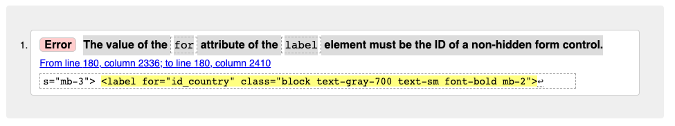
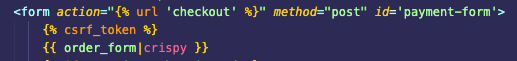
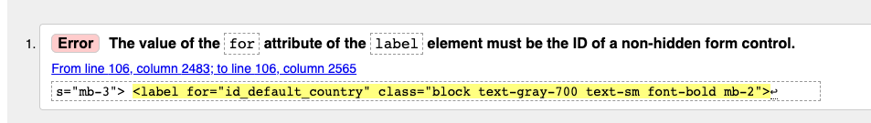
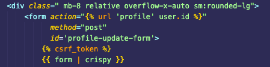
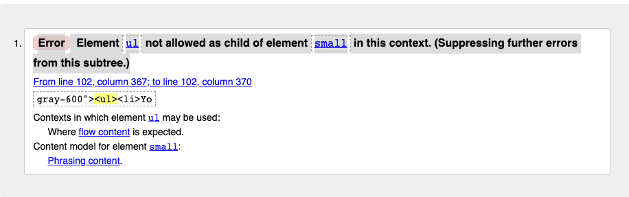
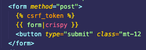
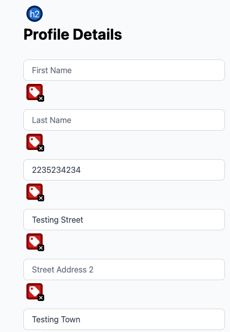
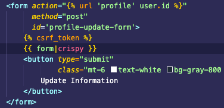

# Test Results

The Manual Testing document can be found here : [ Manual Test Results](/assets/testing/manual-testing.numbers).

## Test Strategy

The test strategy consisted of a combination of manual and automated tests.

- Parts of the appliction rely on CRUD operations to an external DB, and manual test cases were created to ensure isolate those tests that require internet access (Otherwise, a test could fail due to internet connectivity or some server error at the DB site although its application logic was correct). Partially it was started to mock the DB using `django-pytest` and `pytest_factoryboy` , but in the interest of time it was chosen to follow a manual test strategy here.
- The main parts of automated testing focussed on python unit testing with the pytest framework. Most of the functions were isolated from Django in separate files, in order to ensure atomic unit testing of pure application logic following a principle of **design for testability**. The Django functions then simply import the tested functions using pythons `import` statement.
- The modules for JS were tested only manually and via syntax validators

## Table of Contents

- [Test Strategy](#test-strategy)
- [Table of Contents](#table-of-contents)
- [Manual Tests](#manual-tests)
  - [Tests of Accessibility](#tests-of-accessibility)
    - [Results A11y Color Test](#results-a11y-color-test)
    - [Results WebAIM Accesibility Test](#results-webaim-accesibility-test)
    - [Results Google Lighthouse](#results-google-lighthouse)
  - [Tests for Compatibility](#tests-for-compatibility)
  - [Results W3C HTML Validation](#results-w3c-html-validation)
  - [Results W3C CSS Validation](#results-w3c-css-validation)
  - [Results Jshint Javascript Validation](#results-jshint-javascript-validation)
  - [Results Flake8 Python Syntax Validation](#results-flake8-python-syntax-validation)
  - [Results of Authentication Tests](#results-of-authentication-tests)
- [Functionality Tests / User Stories Test](#functionality-tests--user-stories-test)
  - [Results of User Profile Functionality Tests](#results-of-user-profile-functionality-tests)
  - [Results of Comments + Ratings Functionality Tests](#results-of-comments--ratings-functionality-tests)
  - [Results of Checkout Functionality Tests](#results-of-checkout-functionality-tests)
  - [Results of Products Functionality Tests](#results-of-products-functionality-tests)
  - [Results of Testing the deployed version](#results-of-testing-the-deployed-version)
  - [Results of Marketing Functionality Tests](#results-of-marketing-functionality-tests)
  - [Results of Accessibility Tests](#results-of-accessibility-tests)
  - [Issues Found During Manual Testing](#issues-found-during-manual-testing)
- [Automated Tests](#automated-tests)
  - [Results of pytest automated testing](#results-of-pytest-automated-testing)
  - [Coverage Report](#coverage-report)
  - [Running the Tests on Github Actions](#running-the-tests-on-github-actions)

---

## Manual Tests

### Tests of Accessibility

#### Results A11y Color Test

#### Results WebAIM Accesibility Test

While the home page could be checkecd via URL in the automatic color contrast checker, that was not possible for the authenticated pages. For the pages that required authentication, only the color contrast check was done manually for each background-to-text color pair on the page. All Tests passed.

<table>
  <tr>
    <th>
      Wave WebAim Accessibility evalulation - Home Page
    </th>
  </tr>
  <tr>
    <td>
      
    </td>
  </tr>
</table>

<table>
  <tr>
    <th>
      Wave WebAim Accessibility evalulation - Shop Page
    </th>
  </tr>
  <tr>
    <td>
      
    </td>
  </tr>
</table>

<table>
  <tr>
    <th>
      Wave WebAim Accessibility evalulation - Product Detail Page
    </th>
  </tr>
  <tr>
    <td>
      
    </td>
  </tr>
</table>

<table>
  <tr>
    <th>
      Wave WebAim Accessibility evalulation - Shopping Bag Page
    </th>
  </tr>
  <tr>
    <td>
      
    </td>
  </tr>
</table>

<table>
  <tr>
    <th>
      Wave WebAim Accessibility evalulation - Checkout  Page
    </th>
  </tr>
  <tr>
    <td>
      
    </td>
  </tr>
  <tr>
    <td>
    <strong>Note</strong> : The eight errors occur due to a know error of crispy-tailwind. I chose not fix it manually as this part of the page is rendered by an external package, and write a fix would be counter-productive in terms of readibility and maintainability.
    </td>
  </tr>
</table>

<table>
  <tr>
    <th>
      Wave WebAim Accessibility evalulation - Checkout Success Page
    </th>
  </tr>
  <tr>
    <td>
      
    </td>
  </tr>
</table>

<table>
  <tr>
    <th>
      Wave WebAim Accessibility evalulation - Checkout  Page
    </th>
  </tr>
  <tr>
    <td>
      
    </td>
  </tr>
  <tr>
    <td>
    <strong>Note</strong> : The same eight errors occur on the form field due to a know error of crispy-tailwind. Same, I chose not fix it manually as this part of the page is rendered by an external package, and writing a fix would be counter-productive in terms of readibility and maintainability.
    </td>
  </tr>
</table>

#### Results Google Lighthouse

All pages were tested with Google lighthouse using the `chrome-debug` browser as described in this document, using Option 4 of the Lighthouse documentation for testing authenticated pages [Running Lighthouse on Authenticated Pages](https://github.com/GoogleChrome/lighthouse/blob/main/docs/authenticated-pages.md), after globablly installing `lighthouse` with `node`. All Tests passed.

<table>
  <tr>
    <th>
      Google Lighthouse - Home Page (No Authentication needed)
    </th>
  </tr>
  <tr>
    <td>
      
    </td>
  </tr>
</table>

<table>
  <tr>
    <th>
      Google Lighthouse - Shop Detail Page (No Authentication needed)
    </th>
  </tr>
  <tr>
    <td>
      
    </td>
  </tr>
   <tr>
    <td>
    <strong>Note</strong> : Performance could be higher and in one of the next iteration this issue should be addressed, as there is no need to load all the cards before rending the page. For this iteration,  accessibility was prioritized over performance. But for the next iteration, this issue needs to be addressed. 
    </td>
  </tr>
</table>

<table>
  <tr>
    <th>
      Google Lighthouse - Product Detail Page (No Authentication needed)
    </th>
  </tr>
  <tr>
    <td>
      
    </td>
  </tr>
</table>

<table>
  <tr>
    <th>
      Google Lighthouse - Profile Page (Authentication needed)
    </th>
  </tr>
  <tr>
    <td>
      
    </td>
  </tr>
</table>

<table>
  <tr>
    <th>
      Google Lighthouse - Shopping Bag Page (No Authentication needed)
    </th>
  </tr>
  <tr>
    <td>
      
    </td>
  </tr>
</table>

<table>
  <tr>
    <th>
      Google Lighthouse - Checkout Page (No Authentication needed)
    </th>
  </tr>
  <tr>
    <td>
      
    </td>
  </tr>
</table>

<table>
  <tr>
    <th>
      Google Lighthouse - Checkout Success Page (No Authentication needed)
    </th>
  </tr>
  <tr>
    <td>
      
    </td>
  </tr>
</table>

### Tests for Compatibility

### Results W3C HTML Validation

All Pages were tested with the offical W2C HTML validator [Markup Validation Service](https://validator.w3.org/) using the option 'Validate by Direct Input', copying the rendered html code from the browser with `Right Click > View Page Source`.

All tests passed.

<table style="width:90%">
  <tr>
      <th style="width:10%; text-align:center"> Page</th>
      <th style="width:70%"> Output</th>
      <th style="width:20%"> Result</th>
   </tr>
   <tr>
      <td style="text-align:center"> Home</td>
      <td style="width:70%"> </td>
      <td style="width:20%"> Passed </td>
   </tr>
    <tr>
      <td style="text-align:center"> Login</td>
      <td style="width:70%"> </td>
      <td style="width:20%"> Passed </td>
   </tr>
     <tr>
      <td style="text-align:center"> Signup</td>
      <td style="width:70%"> </td>
      <td style="width:20%"> Passed* (a form field rendered by crispy-tailwind caused an error - see Argumentation for TC_19 below)</td>
   </tr>
     </tr>
     <tr>
      <td style="text-align:center"> Shopping bag</td>
      <td style="width:70%"> </td>
      <td style="width:20%"> Passed</td>
   </tr>
    <tr>
      <td style="text-align:center"> Checkout</td>
      <td style="width:70%"> </td>
      <td style="width:20%"> Passed* (a form field rendered by crispy-tailwind caused an error - see Argumentation for TC_19 below)</td>
   </tr>
     <tr>
      <td style="text-align:center"> Checkout Success</td>
      <td style="width:70%"> </td>
      <td style="width:20%"> Passed* (a form field rendered by crispy-tailwind caused an error - see Argumentation for TC_19 below)</td>
   </tr>
     <tr>
      <td style="text-align:center"> Product Detail </td>
      <td style="width:70%"> </td>
      <td style="width:20%"> Passed</td>
   </tr>
     <tr>
      <td style="text-align:center"> Profile </td>
      <td style="width:70%"> </td>
      <td style="width:20%"> Passed* (a form field rendered by crispy-tailwind caused an error - see Argumentation for TC_19 below)</td>
   </tr>
     <tr>
      <td style="text-align:center">  Shop </td>
      <td style="width:70%"> </td>
      <td style="width:20%"> Passed</td>
   </tr>
</table>

### Results W3C CSS Validation

The entire CSS for this project was created by Tailwind's CSS build process. This process can be assumed to function correctly and is therefore not included in the tests.

Since there were no custom CSS files in this project, the test passes.

### Results Jshint Javascript Validation

In the table below the outputs of the JSHint Validation results. No significant errors occured.

<table>
  <tr>
    <th>File</th>
    <th style='width:20%'>Result</th>
    <th> Justificaction of insignificant errors  </th>
  </tr>
  <tr>
    <td>home.js</td>
    <td> 0 errors, 3 warnings </td>
    <td>   warnings regarding ES6 modules. 'const' is available in ES6 (use 'esversion: 6').  Was considered not significant</td>
  </tr>
   <tr>
    <td>products.js</td>
    <td>0 errors, 19  warnings  </td>
    <td>  warnings regarding ES6 and ES8 modules. 'const' is available in ES6 (use 'esversion: 6').  Was considered not significant </td>
  </tr>
   <tr>
    <td>profiles.js</td>
    <td>0 errors,  40 warnings </td>
    <td> warnings regarding ES6 and ES8 modules. 'const' is available in ES6 (use 'esversion: 6'). or  'arrow function syntax (=>)' is only available in ES6 (use 'esversion: 6'). Was considered not significant. Another warning 'Functions declared within loops referencing an outer scoped variable may lead to confusing semantics. (handleCategoryClick); was also considered not significant as I do find the script readable and clean, hence warning not significant. </td>
  </tr>
   <tr>
    <td>quantity_input.js</td>
    <td>0 errors, 18 warnings </td>
    <td> warnings regarding ES8 modules. 'Trailing comma in arguments lists' is only available in ES8 (use 'esversion: 8'). Was considered not significant   </td>
  </tr>
  <tr>
    <td>stripe_element.js</td>
    <td>0 errors, 17 warnings </td>
    <td> warnings regarding ES8 modules. 'Trailing comma in arguments lists' is only available in ES8 (use 'esversion: 8'). Was considered not significant   </td>
  </tr>
</table>

### Results Flake8 Python Syntax Validation

In the table below the outputs of the Flake8 Python Validation results. No significant errors occured.

<table>
  <tr>
    <th> Flake8 linter output </th>
    <th style='width:20%'>Result</th>
  </tr>
   <tr>
     <td style="width:70%"> 
        
      </td>
    <td> Passed - The warnings regarding the migrations will be ignored as they were automatically generated from Django.  </td>
  </tr>
</table>

### Results of Authentication Tests

## Functionality Tests / User Stories Test

### Results of User Profile Functionality Tests

### Results of Comments + Ratings Functionality Tests

### Results of Checkout Functionality Tests

### Results of Products Functionality Tests

### Results of Testing the deployed version

### Results of Marketing Functionality Tests

### Results of Accessibility Tests

### Issues Found During Manual Testing

There were several issues found during Manual Testing that required refactoring of the code to make it pass the test.

<table style="width:90%">
    <tr>
        <th style="text-align:center;width:10%"> Test Case</th>
        <th style="width:35%"> Description </th>
        <th style="width:60%"> Errors Found  </th>
    </tr>
    <tr>
      <td style="text-align:center"> TC_19 </td>
      <td> Validate that all pages pass W3C HTML Validation Tool (Landing Page)   </td>
      <td> 
         <ul>
            <li> In the first round, the HTML validator noted a stray div HTML element at the end of the landing page, and raised an error. </li>
            <li> After removing the stray div, the test passed </li>
         </ul>
     </td>
    </tr>
    <tr>
      <td style="text-align:center"> TC_19 </td>
      <td> Validate that all pages pass W3C HTML Validation Tool (Product Detail Page)   </td>
      <td> 
         <ul>
            <li> In the first round, the HTML validator noted:  a div inside a label element,  an unclosed div elemen end of a form element but but no opening element of a form, a duplicate 'class attribute' and an unclosed paragraph </li>
            <li> After adjusting the HTML code, the test passed </li>
         </ul>
     </td>
    </tr>
    <tr>
      <td style="text-align:center"> TC_19 </td>
      <td> Validate that all pages pass W3C HTML Validation Tool  (Shopping Bag Page)    </td>
      <td> 
         <ul>
            <li> In the first round, the HTML validator noted: a quote in an attribute name , and unclosed body tag and an unclosed div </li>
            <li> After adjusting the HTML code, the test passed </li>
         </ul>
    </td>
    </tr>
    <tr>
      <td style="text-align:center"> TC_19 </td>
      <td> Validate that all pages pass W3C HTML Validation Tool  (Checkout Page)    </td>
      <td> 
         <ul>
            <li> In the first round, the HTML validator noted: a quote in an attribute name , a stray end div, and that the value for a for label did not have a matching ID of a form control element </li>
            <li> After adjusting the HTML code, the test still failed with an error regarding the label of the country form field </li>
             
             
            <li> This part of the HTML is rendered by `Crispy-Tailwind` [Link](https://django-crispy-forms.github.io/crispy-tailwind/). It did not seem reasonable in terms of code readibility and maintainability to overwrite the behaviour of this package.</li>
            <li> Aside from this single error, the test passes. </li>
         </ul>
    </td>
    </tr>
     <tr>
      <td style="text-align:center"> TC_19 </td>
      <td> Validate that all pages pass W3C HTML Validation Tool  (Checkout Success Page)    </td>
      <td> 
         <ul>
            <li> In the first round, the HTML validator noted: an obsolete scope element in the td element which should only be used in the th element (table header).  </li>
            <li> After adjusting the HTML code, the test passed </li>
         </ul>
    </td>
    </tr>
     <tr>
      <td style="text-align:center"> TC_19 </td>
      <td> Validate that all pages pass W3C HTML Validation Tool  (Profile Page)    </td>
      <td> 
         <ul>
            <li> In the first round, the HTML validator noted: Element ul not allowed as child of element ul,End tag td seen, but there were open element, Unclosed element ul  , Quote ' in attribute name, Duplicate ID error,the value of the for attribute of the label element must be the ID of a non-hidden form control. </li>
            <li> After adjusting the HTML code, the test still failed with the same error as the Checkout Page complaining about the country form fields rendered by Crispy-Tailwind </li>
             
             
            <li> This part of the HTML is rendered by `Crispy-Tailwind` [Link](https://django-crispy-forms.github.io/crispy-tailwind/). It did not seem reasonable in terms of code readibility and maintainability to overwrite the behaviour of this package.</li>
            <li> Aside from this single error, the test passes. </li>
         </ul>
    </td>
    </tr>
    <tr>
      <td style="text-align:center"> TC_19 </td>
      <td> Validate that all pages pass W3C HTML Validation Tool  (Signup Page)    </td>
      <td> 
         <ul>
            <li> In the first round, the HTML validator noted an Error: Element ul not allowed as child of element small in this context. (Suppressing further errors from this subtree.).  </li>
              
             
            <li> This part of the HTML is rendered by `Crispy-Tailwind` [Link](https://django-crispy-forms.github.io/crispy-tailwind/). It did not seem reasonable in terms of code readibility and maintainability to overwrite the behaviour of this package.</li>
            <li> Aside from this single error, the test passes. </li>
         </ul>
    </td>
    </tr>
    <tr>
      <td style="text-align:center"> TC_21 </td>
      <td> Validate that all javascript files pass jshint validator    </td>
      <td> 
         <ul>
            <li> In the first round, the js validator noted the user of ES6 tags such as arrow functions and const variables which I call as insignificant.  </li>
            <li> For various javascript files, jshint complained as well that I was using function delcarations out of the scope (' Functions declared within loops referencing an outer scoped variable may lead to confusing semantics. (handleSubmitCommentClick)').  In this instance, I do find my way of declaring function not confusing and call this an insignifcant error</li>
            <li> Aside from these insignificant warnings, the test passes. </li>
         </ul>
    </td>
    </tr>
    <tr>
      <td style="text-align:center"> TC_22 </td>
      <td> Validate that all custom python files pass flake8 validator    </td>
      <td> 
         <ul>
            <li> In the first round, flake8 noted many files that were auto-generated by Django, i.e.: ./accounts/tests.py:1:1: F401 'django.test.TestCase' imported but unused , ./bag/admin.py:1:1: F401 'django.contrib.admin' imported but unused </li>
            <li> Some files created by Django (i.e. Migrations) I did not touch</li>
            <li> Some files created by Django (i.e. ./accounts/tests.py,  ./bag/admin.py ...) I removed the unused import</li>
            <li> Some view files had a line too long error ( E501 line too long (115 > 79 characters)). These files were reformatted manually file-by-file or made exempt from flake8 (using the #noqa flag) as it would not make the Django application safer to split a string in the middle of a word. </li>
            <li> After these corrections, the test passes. </li>
         </ul>
    </td>
    </tr>
    <tr>
      <td style="text-align:center"> TC_24 </td>
      <td> Validate that website passes WAVE WebAIM  Accessibility Check with no Errors     </td>
      <td> 
         <ul>
            <li> In the first round, the Home Page raised 3 errors (link has no text error),  and the Profile page raised 40 errors  </li>
            <li>The errors on the Home Page we addressed by adding a span of class 'sr-only' with the label 'shopping bag', then the error was cleared</li>
            <li> On the Profile field, most of the errors were 'empty button' and 'missing form label' errors rated the rating with stars. After adding an appropriate label to each star and form field, error was cleared</li>
            <li> After these corrections, form fields still have no label. It seems like an open bug from 'tailwind-crispy'. I tried the options listed on their GihThub issue page (https://github.com/django-crispy-forms/crispy-tailwind/issues/110) but none of these fixed the error. There is the option of manually adding aria labels via javascript - but I find it not ideal in terms of code readibility to mess with an imported package, and leave the error for now.   </li>
            <li> Same error with tailwind-crispy form happens on the checkout page</li>
            <li> I call this error not significant and let it pass with this notice of an external dependency failing</li>
              
              
         </ul>
    </td>
    </tr>

</table>

---

## Automated Tests

### Results of pytest automated testing

### Coverage Report

### Running the Tests on Github Actions
